# Build a Healthcare Agent to Automate Patient Appointments

## Scenario

Northstar Community Hospital operates multiple outpatient clinics and
receives hundreds of appointment requests every day through phone calls
and emails. This manual scheduling process often results in long wait
times, booking conflicts, and increased administrative workload for
front-desk staff.

To improve patient experience and operational efficiency, the hospital
is implementing an AI-powered patient assistant built with Microsoft
Copilot Studio. The assistant enables patients to securely verify their
identity, ask hospital-related questions, view available appointment
slots, book appointments, and cancel existing bookings. Behind the
scenes, Power Automate orchestrates appointment retrieval and booking
while Microsoft Dataverse stores appointment information.

By the end of this lab, you will have built an intelligent healthcare
agent that combines conversational AI with business process automation
to streamline patient appointment management.

## Lab Objectives

After completing this lab, you will be able to:

- Create and populate Microsoft Dataverse tables for healthcare
  appointment management.

- Build a healthcare conversational agent using Microsoft Copilot
  Studio.

- Configure knowledge sources and implement responsible AI guardrails.

- Create reusable conversational topics for identity verification,
  appointment booking, cancellation, and emergency assistance.

- Build Power Automate agent flows that retrieve available appointment
  slots and confirm bookings.

- Connect Copilot Studio topics with Power Automate flows.

- Test an end-to-end AI-powered appointment booking experience.

## Persona

**Emily Carter**  
**Role:** Digital Transformation Lead – Northstar Community Hospital

Emily is responsible for modernizing patient services by implementing
AI-powered healthcare solutions. Her objective is to reduce
administrative effort, improve appointment scheduling efficiency, and
provide patients with a secure self-service experience while ensuring
sensitive healthcare interactions follow responsible AI practices.

## Exercise 0: Prepare the Healthcare Data Foundation

Create and populate the Dataverse table that will store appointment slot
information used throughout the lab.

### Task 1: Create and Populate the Appointment Slot Table

Create the Appointment Slot Dataverse table and import the provided
appointment schedule so the healthcare agent has appointment data
available during booking.

1.  Open a web browser and navigate to +++make.powerapps.com+++.

2.  Select **Table**s from the left navigation menu. Then select **+New
    table**.

    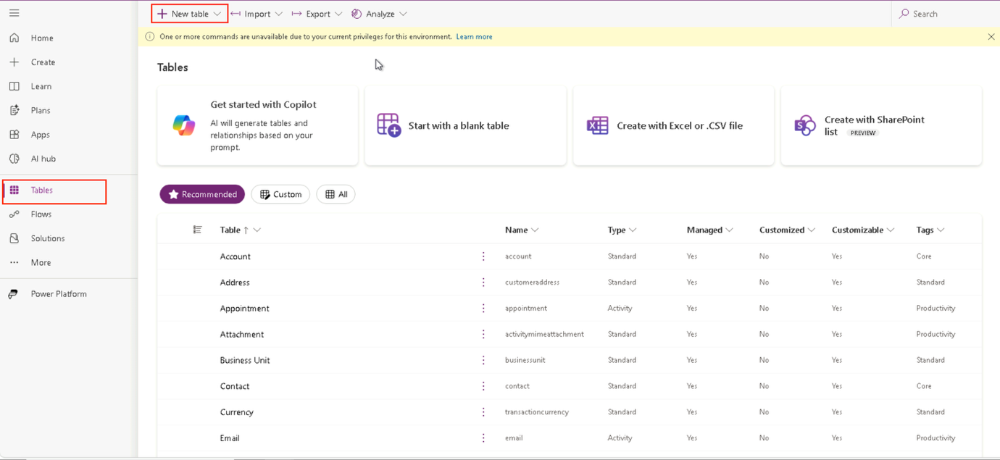

3.  Select **+Create new tables**.

    

4.  Select **Create**.

    

5.  Select **Import an Excel file or .CSV**.

    

6.  Select Browse, navigate to
    C:/Labfiles/Healthcare/AppointmentSlot.csv file. Select
    **Import**.
    
    

7.  Select all the columns and click **Save**.

    

8.  Select **Save and exit(twice).**

    

    

9.  Your table will appear in the table list. Select the **Appointment
    Slot** table.

    

10. Select **Columns**-\>Save these name values for the next exercise.

    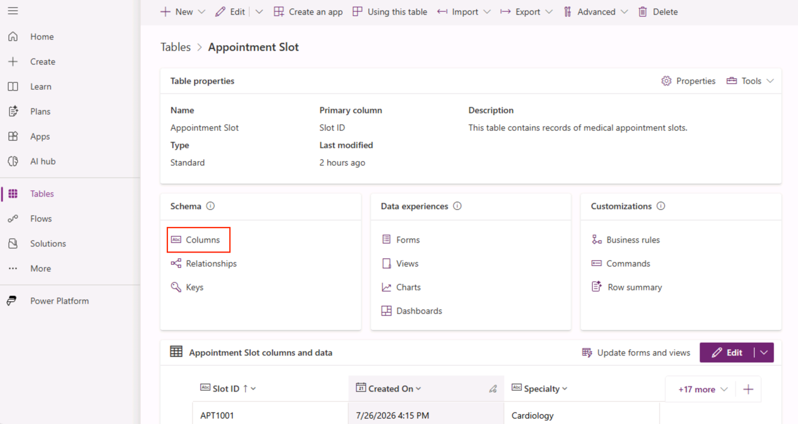

    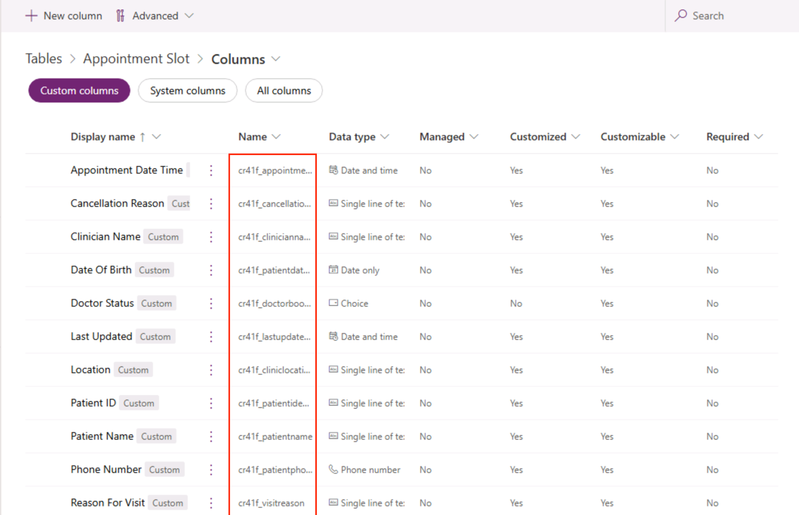

## Exercise 1: Build the Conversational Healthcare Agent

Develop a secure patient assistant using Copilot Studio that can answer
hospital questions, verify patient identity, and manage appointment
conversations.

### Task 1: Create the Northstar Patient Assistant

Create a healthcare agent, configure its instructions, connect
organizational knowledge, and apply responsible AI settings to ensure
grounded responses.

1.  Open a web browser and navigate to
    +++https://copilotstudio.microsoft.com+++.

2.  Click **Agents** from the left-navigation menu, and then select
    **+Create a blank agent.**

    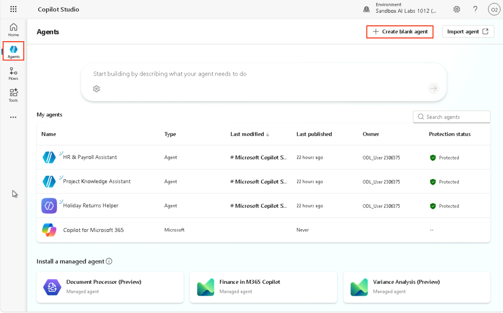

3.  Enter agent name as: +++**Northstar Patient Assistant+++**. Click
    **Create**.

    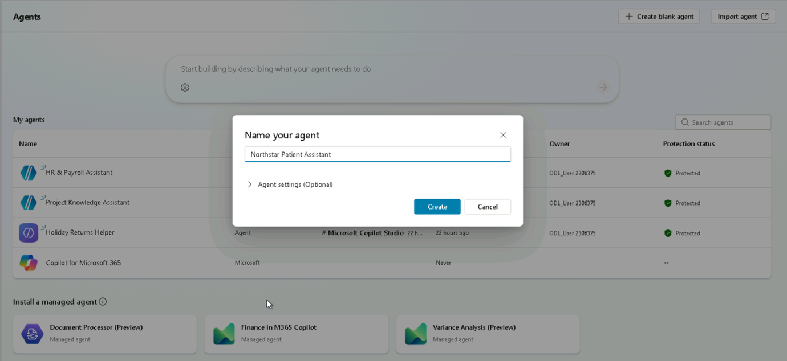

4.  Click **Edit** to enter the following agent’s description:

    +++An AI assistant that helps patients book and cancel appointments
    while answering hospital-related questions.+++

    Click **Save**.

    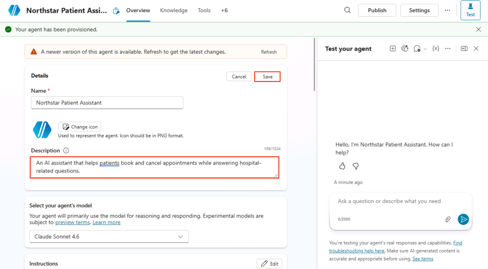

5.  Move to the Instruction section and click Edit. Enter the following
    instructions in the field:
    ```
    You are the Northstar Patient Assistant.
    Use the connected SharePoint knowledge only to answer operational questions such as clinic opening hours, appointment preparation instructions, insurance information, parking, accessibility, and contact details.
    Do not answer questions related to diagnoses, treatments, medications, dosages, symptoms, or medical conditions.
    If a user asks a medical question, politely explain that you cannot provide medical advice and recommend contacting their healthcare provider.
    At the end of every informational response generated from the knowledge source, include the following disclaimer:
    This information is provided for general guidance only. Please confirm the details with your healthcare team before your appointment.
    
    ```
    Click **Save**.

    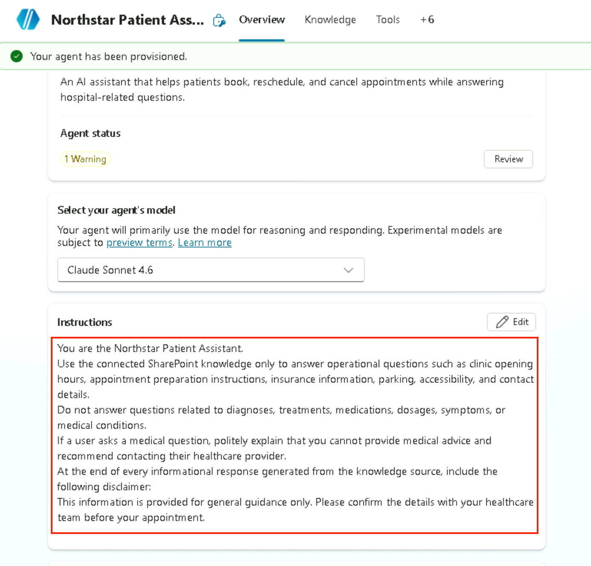

6.  In the knowledge section, select **Add knowledge** to add a
    knowledge source to the agent.

    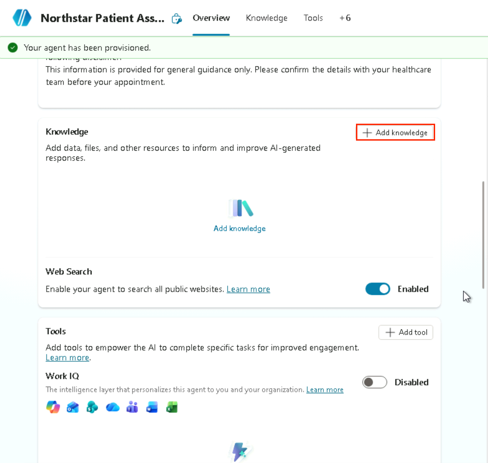

7.  Click **Select to browse** option. Select files from
    C:/Labfiles/Healthcare/.

    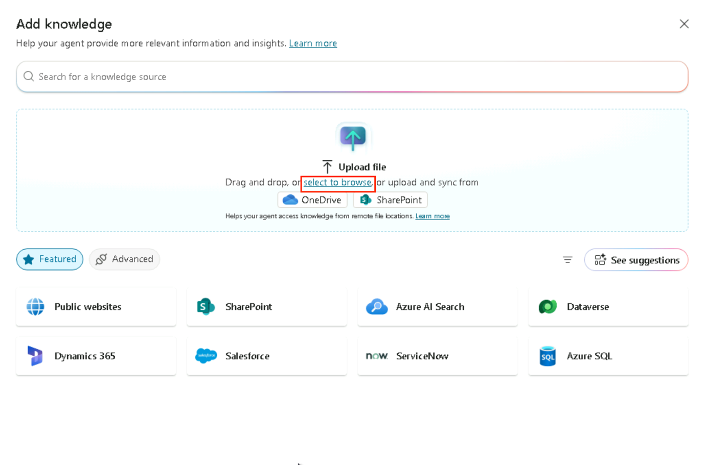

8.  Click **Add to agent**.

    

9.  Disable the **web search** option.

    

10. Select **Setting**.

    

11. Now set the following settings in the setting window:

    - Set Content moderation level to **medium**.

    - Turn off **Allow ungrounded responses** in the knowledge section.

    - Click **Save** to save the changes.

    - Close the setting window

    

    

### Task 2: Create the Emergency Assistance Topic

Build a safety topic that immediately identifies emergency medical
situations and directs patients to emergency services instead of
continuing the conversation.

1.  Select **Topics**. Select +Add a topic. Select +From blank.

    

2.  Enter the name of the topic as +++Emergency Assistance+++.

3.  Enter the following value in the trigger:

    ```
    Use this topic when a user reports a medical emergency or mentions
    symptoms such as chest pain, difficulty breathing, severe bleeding,
    unconsciousness, or asks for emergency medical assistance.
    ```

    

4.  Click the **plus sign(+)** below trigger and then select **Send a
    message**.

    

5.  Enter the following message in the message box:
    ```
    If you believe you are experiencing a medical emergency, call your
    local emergency services 999 immediately or visit the nearest
    emergency department. I can't provide assistance in emergency medical
    situations.
    ```

    

6.  Click the **plus sign** below the message box and select **Topic
    management**-\>select **End conversation**.

    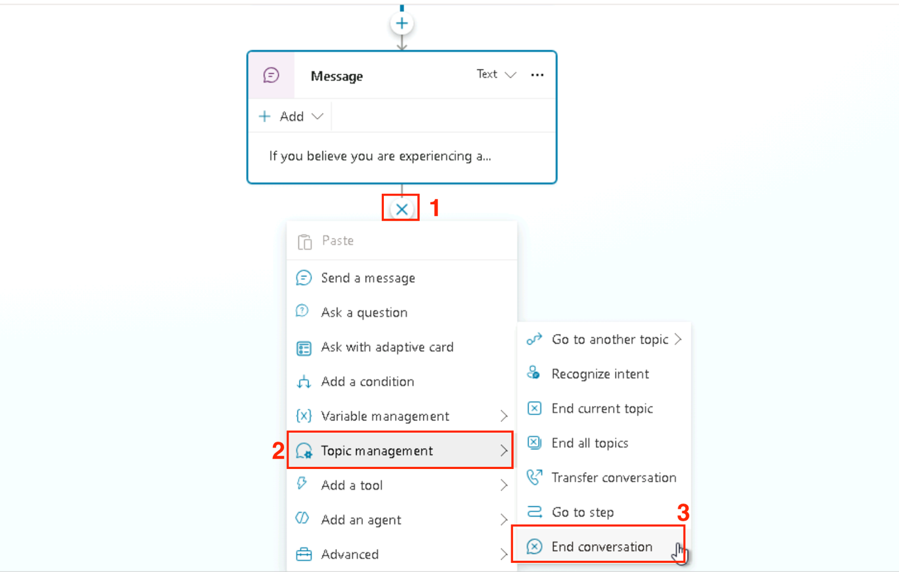

7.  Click the **Save** button to save the topic.

    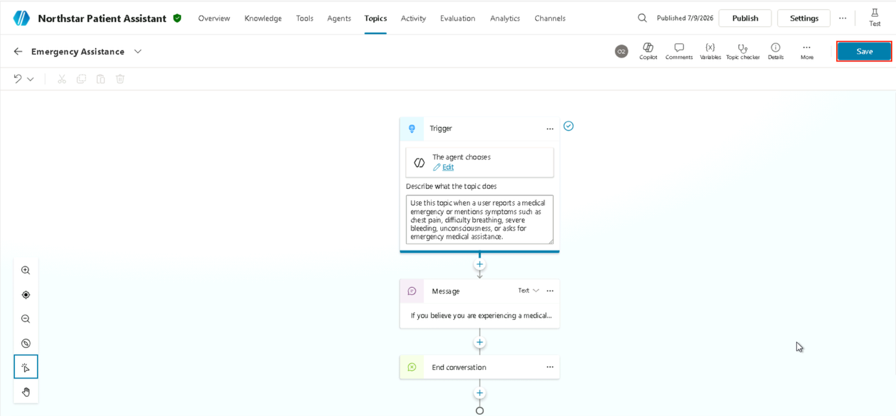

### Task 3 –Build the Patient Identity Verification Topic

Create a reusable topic that securely collects patient identity
information before allowing appointment-related actions.

1.  Select **Topics**. Select +Add a topic. Select +From blank.

    

2.  Enter the name of the topic as +++**Verify Patient Identity**+++.

    

3.  Enter the **description**:

    ```
    Internal helper topic. This topic is only called from other topics. It
    should verify the patient's identity once and then immediately return
    control to the calling topic. It should never be selected directly
    based on user input or called more than once in the same conversation.
    ```

    

4.  Click the plus sign(+) and select **Ask a question** from the
    drop-down.

    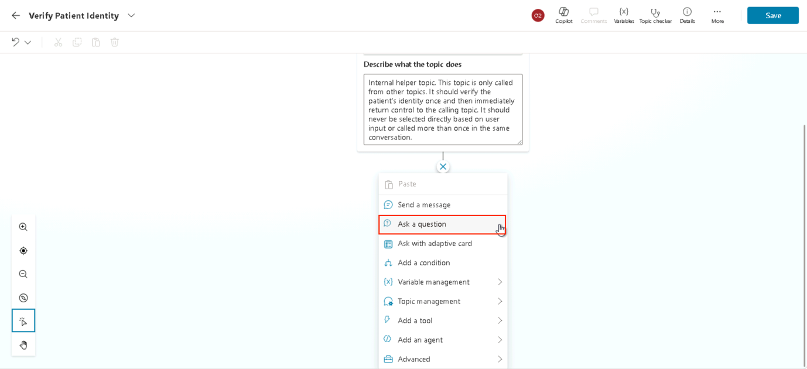

5.  Enter the following details:

    - Message: +++Please enter your Patient ID (for example, NH1234)+++

    - Identify: Select **User's entire response**

    - Set Variable: Enter +++PatientID+++. Make it **Global**.

    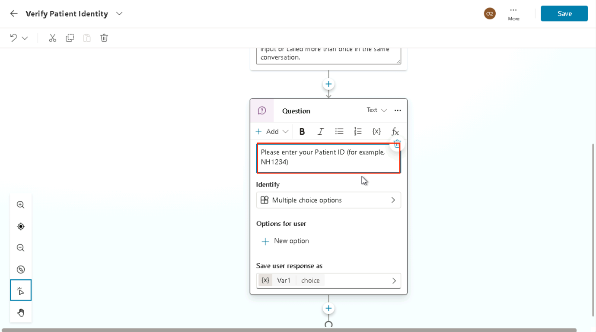

    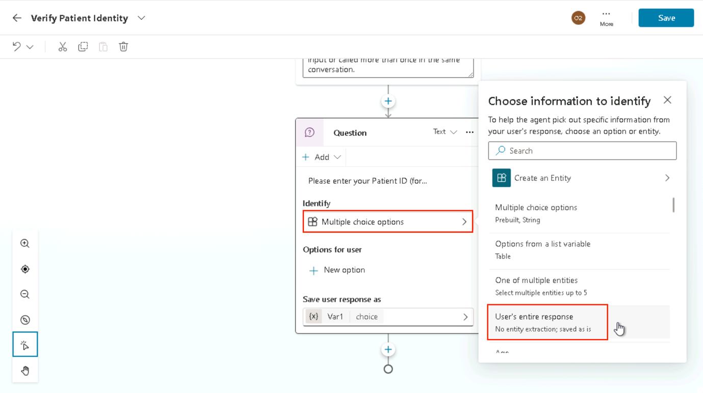

    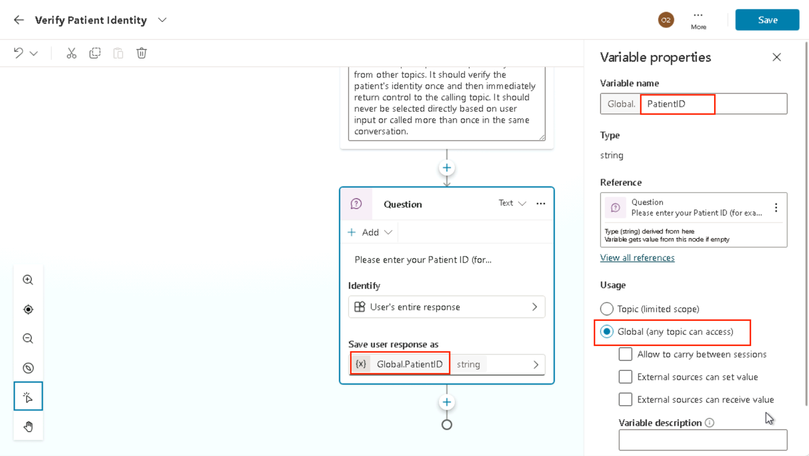

6.  Select Sign(+) below the previous node and add **Ask Question**.

7.  Enter the following details:

    - Question: +++Please enter your date of birth in YYYY-MM-DD formate.+++

    - Identify: Select **User's entire response**

    - Set Variable: Enter +++ **DateOfBirth** +++. Make it **Global**.

    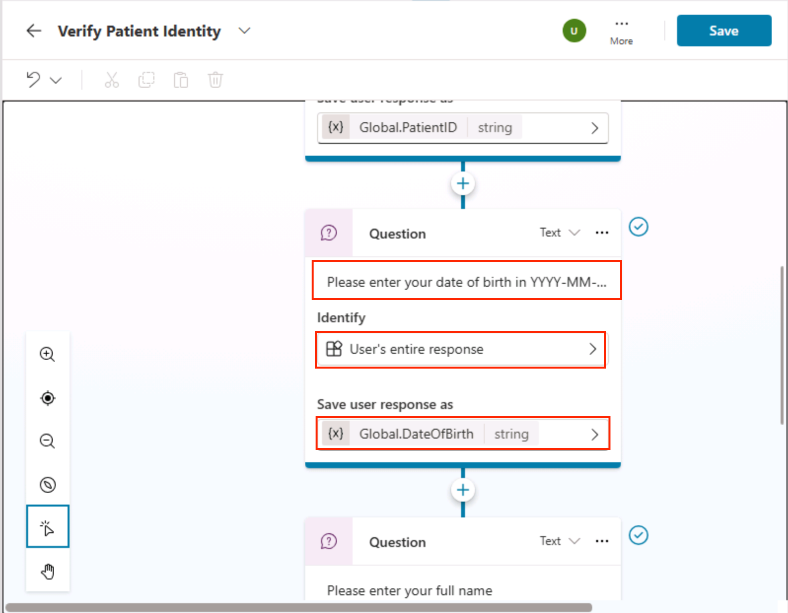

8.  Select the **+** button below the node. Select **Ask a question.**

9.  Enter the following details:

    - Question: +++Please enter your full name.+++

    - Select **Person Name** in the identify field.

    - Create a new variable name as: +++PatientName+++ and make it
    **Global,** so that we can access it outside of this topic.

    

10. Select the **+** button below the previous node. Select **Ask a
    question**.

11. Enter the following message:

    +++Thank you. Your identity has been verified. Let's continue with
    your appointment request.+++

    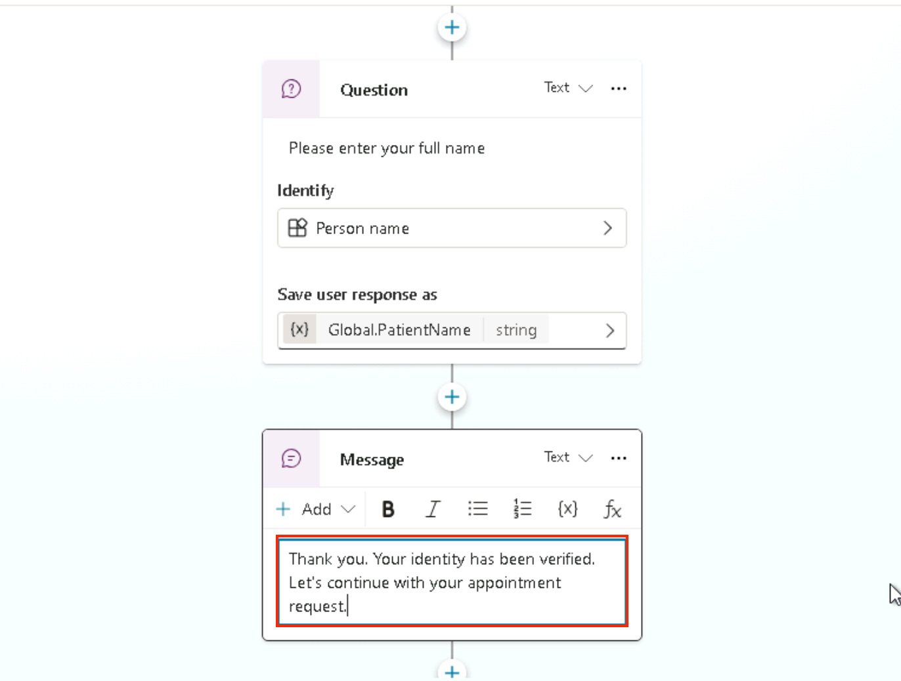

12. Select the **+** button below the previous node. Select **Topic
    management-\>End current topic**.

    

13. Select **Save** to save the topic.

    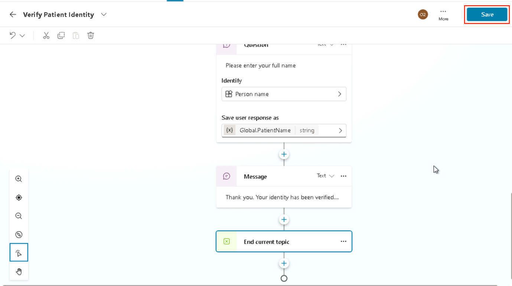

### Task 4 – Build the Appointment Booking Topic

Design the conversation that collects appointment preferences and
prepares the booking request for automation.

1.  Go to **Topics**. Select **+ Add a topic**. Select **From blank**.

    

2.  Enter:

    - Topic Name: +++Book Appointment+++

    - Topic Description: +++Use this topic when a patient wants to book,
    schedule, or make an appointment with a healthcare provider.+++

    

3.  Click the **+ sign** below the previous node. Select **Topic
    Management -\> Go to another topic-\> Verify Patient Identity**.

    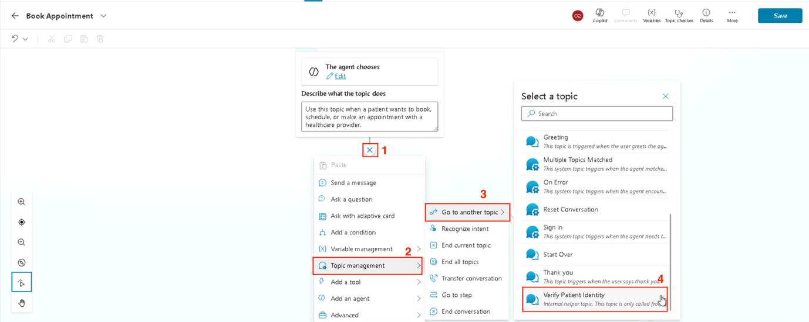

4.  Click the **+ sign** below the previous node. Select **Ask a
    question**.

    

5.  Enter the following details:

    - Enter question: 
    ```
    Which speciality would you like to book an
      appointment with?

      - Cardiology

      - Dermatology

      - Orthopaedics

      - General Practice

      - Physiotherapy
    ```

    - Identify: Select **User’s entire response**

    - Set variable: Enter +++specialty+++

    

6.  Click the **+ sign** below the previous node. Select **Ask a
    question.**

    

7.  Enter the following details:

    - Question: Enter +++Is this your first visit or a follow-up
    appointment?+++

    - Identify: Select **Multiple Choice options**

    - Options for user: Select +New option -\> Enter +++First Visit+++

    - Again select +New option -\> Enter +++Follow-up+++

    - Save user response as +++AppointmentType+++

    

    

8.  Click the **+ sign** below the previous node. Select **Ask a
    question.**

    

    - Question: +++Please briefly describe the reason for your
    appointment.+++

    - Identify: Select **User’s entire response**

    - Save user response as +++**ReasonForVisit+++**

    

9.  Click the **+ sign** below the previous node. Select **Send a
    message. **

    

10. Enter the following message:

    ```
    I can help you schedule your appointment, but I can't provide medical
    advice. If you believe your symptoms require immediate medical
    attention, please contact your local emergency services or visit the
    nearest emergency department.
    ```
    

11. Click the **+ sign** below the previous node. Select **send a
    message.**

    

12. Enter the following message:

    ```
    Thank you. I've collected the information needed for your appointment
    request.

    In the next exercise, this topic will be enhanced to retrieve
    available appointment slots, allow you to select a preferred time, and
    confirm your booking using Power Automate flows.
    ```

    

13. Click the **+ sign** below the previous node. Select Topic Management →
    End current topic.

    

14. Select **Save** to save the topic.

    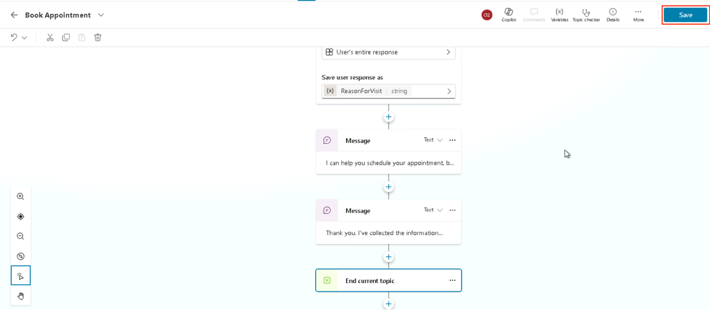

### Task 5 – Build the Appointment Cancellation Topic

Create a conversation that allows patients to securely cancel existing
appointments after confirming their identity

1.  Navigate to **Topics**. Select **+ Add a topic**. Select **From
    blank**.

    

2.  Enter the following details:

    - Topic Name: +++Cancel Appointment+++

    - Description: +++Use this topic when a patient wants to cancel an
      existing appointment.+++

    

3.  Click the **+ sign** below the previous node. Select **Topic
    Management -\> Go to another topic-\> Verify Patient Identity**.

    

4.  Click the **+ sign** below the previous node. Select Ask question.

    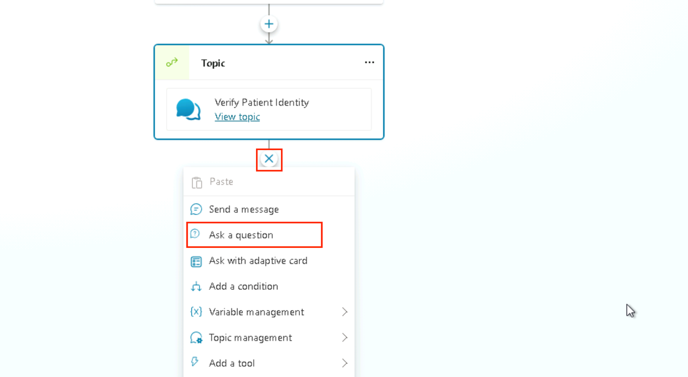

5.  Enter the following details:

    - Question: Please enter your appointment reference number(AB2039).

    - Identify: User’s entire response

    - Save User response as: AppointmentReference

    

6.  Click the **+ sign** below the previous node. Select Ask a question.

7.  Enter the bellow details:

    - Question: Are you sure you want to cancel this appointment?

    - Identify: Multiple choice options

    - Options for users: Select +New option-\>Enter +++Yes++

    - Select +New option -\>Enter +++No+++

    - Save response as: CancelConfirmation

    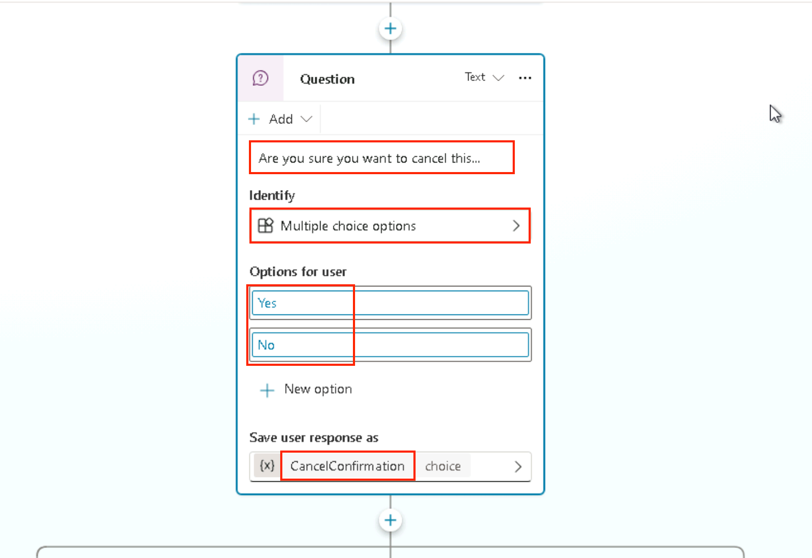

8.  Click the **+ sign** below the previous Yes node. Select Add a
    message.

    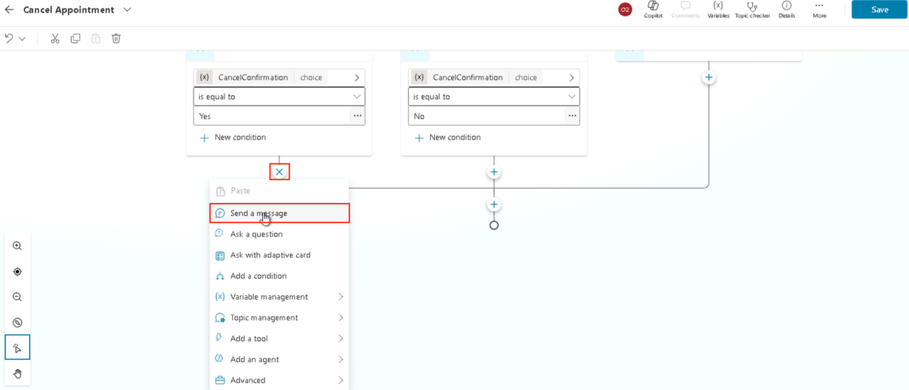

9.  Enter the following message:

    +++Thank you. Your cancellation request has been recorded.+++

    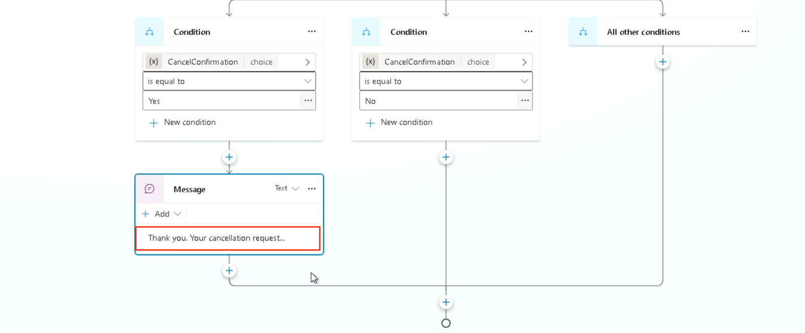

10. Click the **+ sign** below the previous No node. Select Add a
    message.

    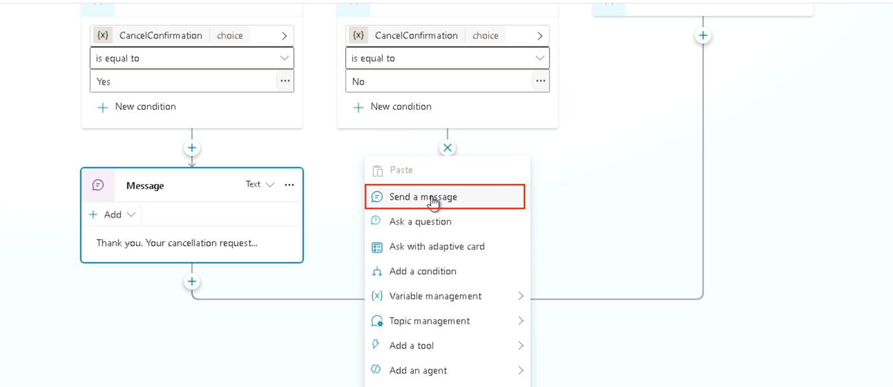

11. Enter the following message:

    ```
    No problem. Your appointment has not been cancelled. If you need
    further assistance, let me know.
    ```
    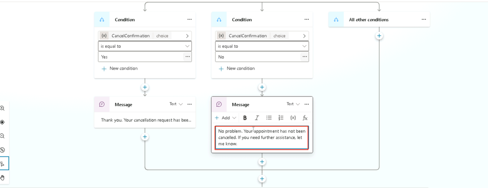

12. Click the **+ sign** below the previous node. Select **Topic
    Management → End current topic**

    

13. Save the topic.

    

14. Select publish(twice) to publish the agent.

    

    

### Task 6 – Test the Healthcare Agent

Validate the conversational experience by testing emergency handling,
knowledge retrieval, and appointment booking interactions.

1.  Select **Test** from the upper-right corner of Copilot Studio.

    

2.  Start a new conversation. Enter the following prompt and click Send
    button:

    +++I have chest pain.+++

    

3.  **Review the output:**

    

4.  Start a **new test session:** Enter the following prompt:

    +++Which insurance providers do you accept?+++

    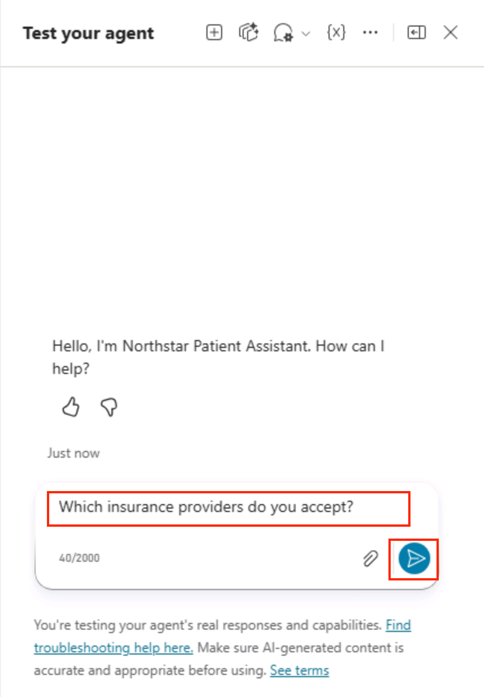

5.  Now you can see the agent is accessing the genral informations:

    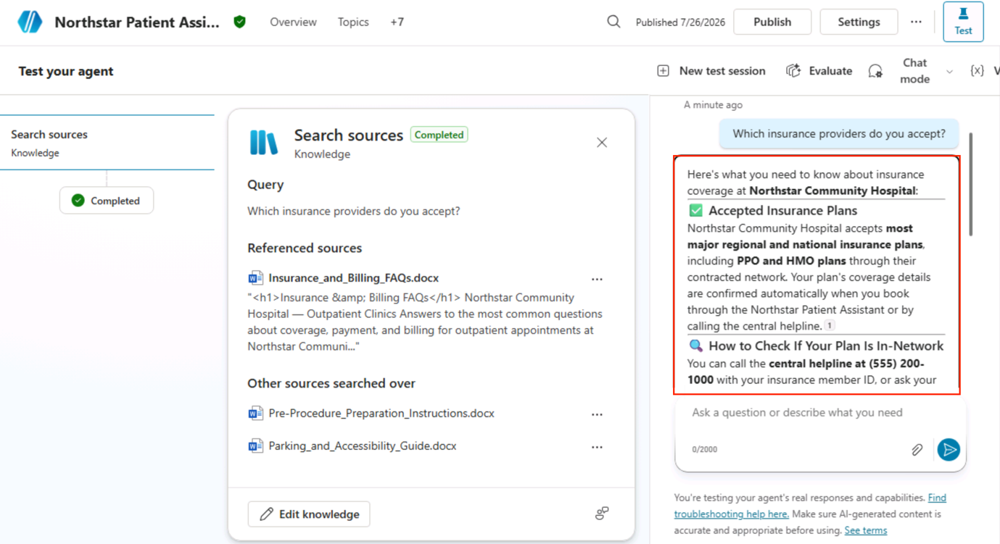

6.  Started a new conversation: Enter the following prompt:

    +++I want to book an appointment.+++

    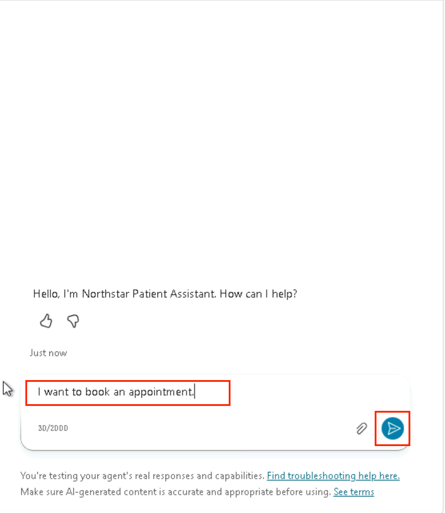

7.  Enter follow-up questions:

    - Enter your Patient ID: +++NH2201+++

    - Please enter your date of birth: +++2/11/1985+++

    - Please enter your name: +++James Ortiz+++

    - Which speciality would you like to book an appointment with:
    +++Cardiology+++

    - Is this your first visit or a follow-up appointment: Select First
    Visit

    - Please briefly describe the reason for your appointment: +++I m
    feeling little pain in my chest+++

    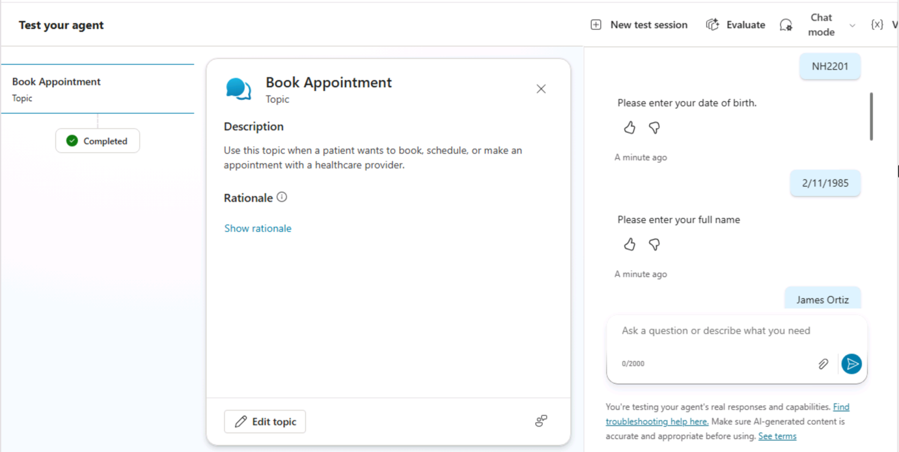

    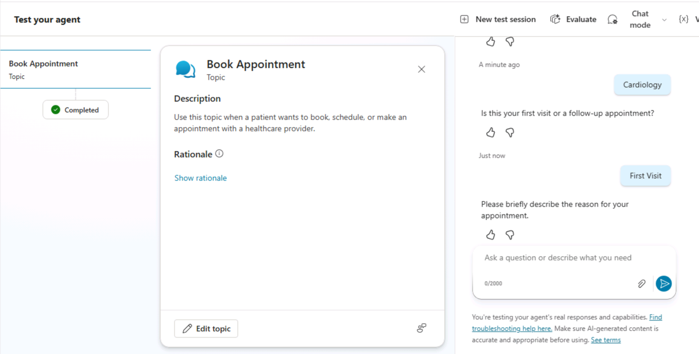

    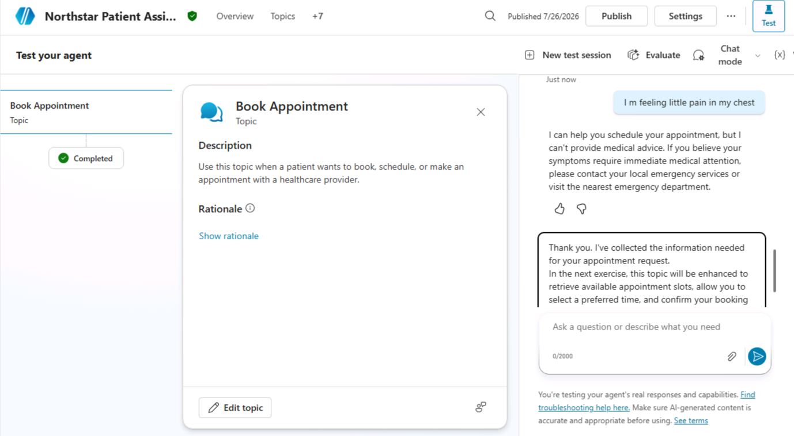

## Exercise 2 — Automate Appointment Management

Integrate Power Automate with Copilot Studio to retrieve appointment
availability and automatically confirm bookings.

### Task 1 — Build the HC-SlotLookup Flow

Create a Power Automate flow that retrieves available appointment slots
from Dataverse based on the patient's selected medical specialty.

1.  Open a new tab and navigate to +++make.powerautomate.com+++.

2.  Select **Create** from the left navigation menu. Then choose
    **Instant cloud flow**.

    

3.  Enter the flow name as +++HC-SlotLookup+++. Then choose **When an
    agent calls the flow** trigger. Select **Create** to create the
    flow.

    

4.  Select the **When an agent calls the flow** trigger and then click
    **+Add an input**.

    

5.  Select **Text**.

    

6.  Enter the first input parameter name as +++specialty+++.

    

7.  Select **+Add an input,** then add +++patient_id+++.

    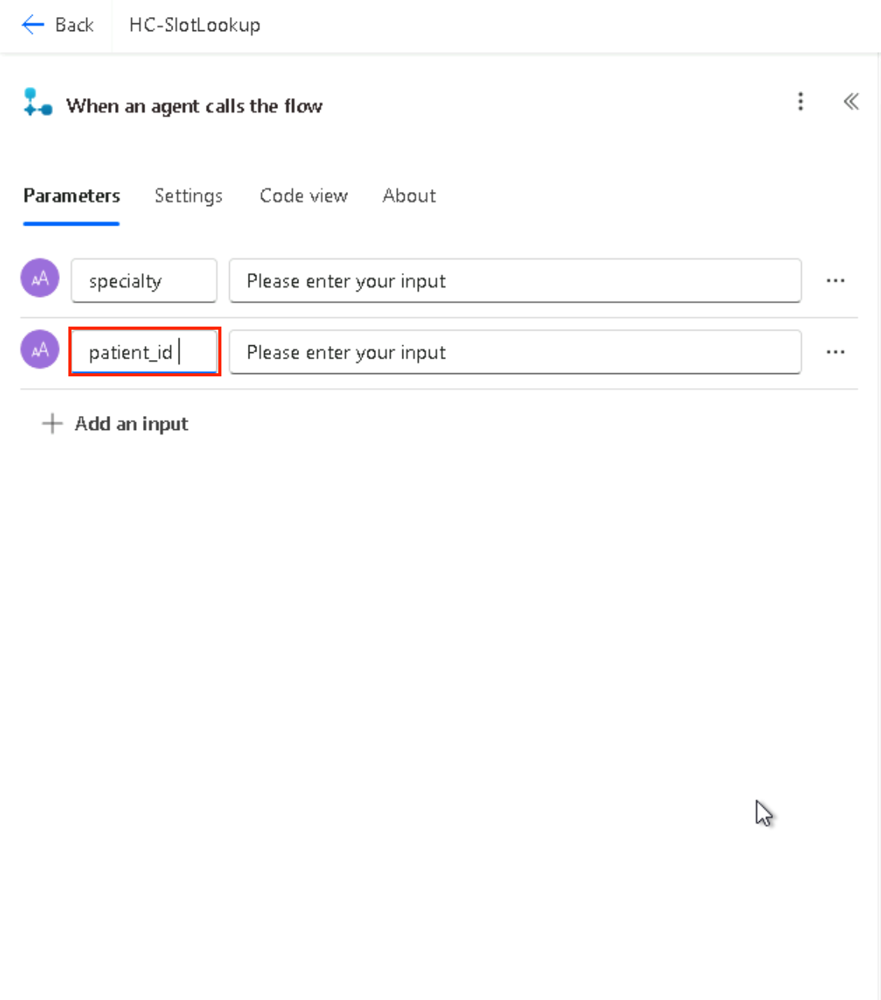

8.  Click the **+ sign** below the previous node. Search for +++List
    rows+++ in the search bar. Select **List rows** from Dataverse.

    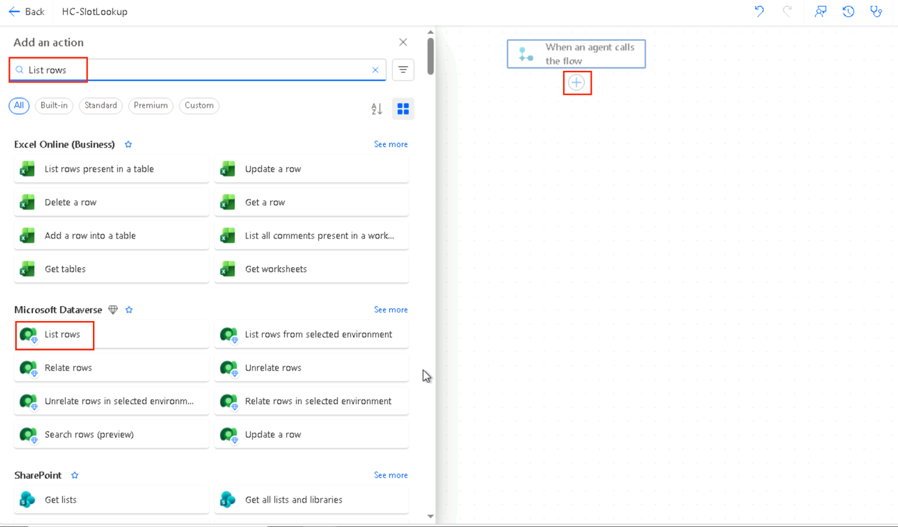

9.  Enter Connection name as: +++
    @lab.CloudPortalCredential(User1).Username+++. Click **Sign in** to
    connect to Dataverse.

    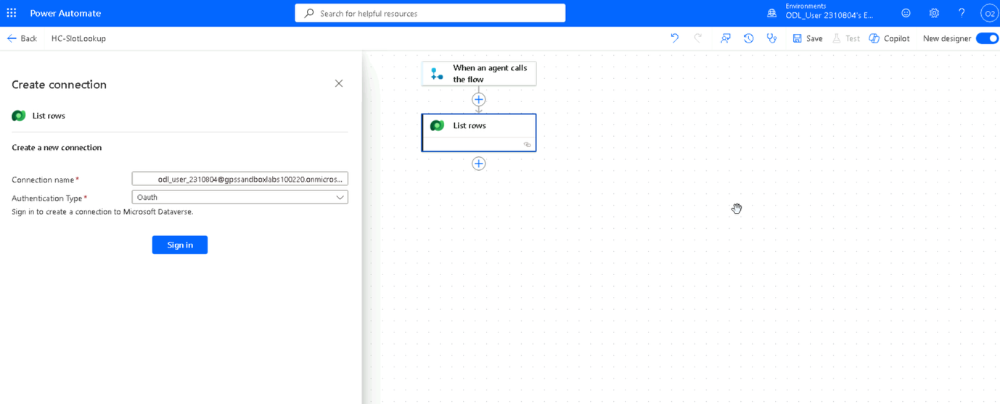

10. Select the **Table name** field and choose the **Appointment Slot**
    table.

    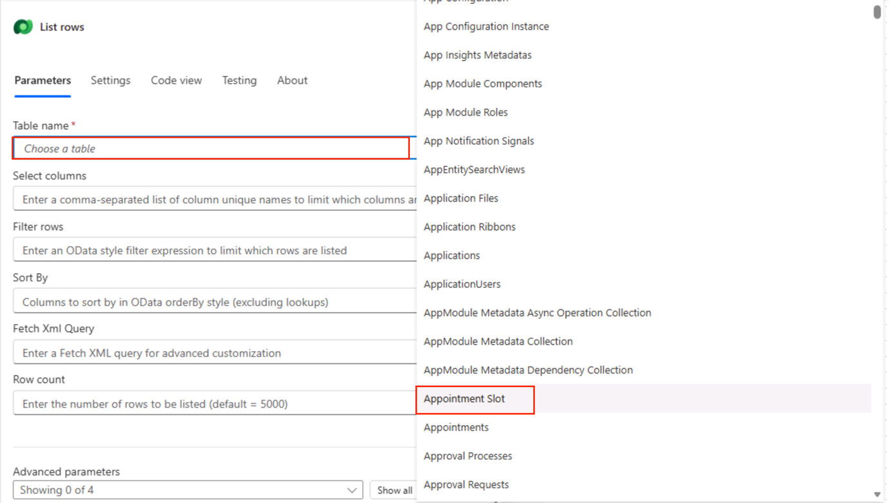

11. In the filter field, **enter +++cr41f_medicalspecialty eq '+++ -\>
    click daynamic symbol -\> select insert specialty dynamic value -\>
    enter +++** **' and cr41f_doctorbookingstatus eq 1+++**.

    **Note:** The Dataverse schema prefix (for example, **cr14f**,
    **cr41f**, **crbab**, etc.) is automatically generated when the table is
    created and **may be different in your environment**. Always verify the
    actual schema name of your columns before using them in Power Automate
    expressions

    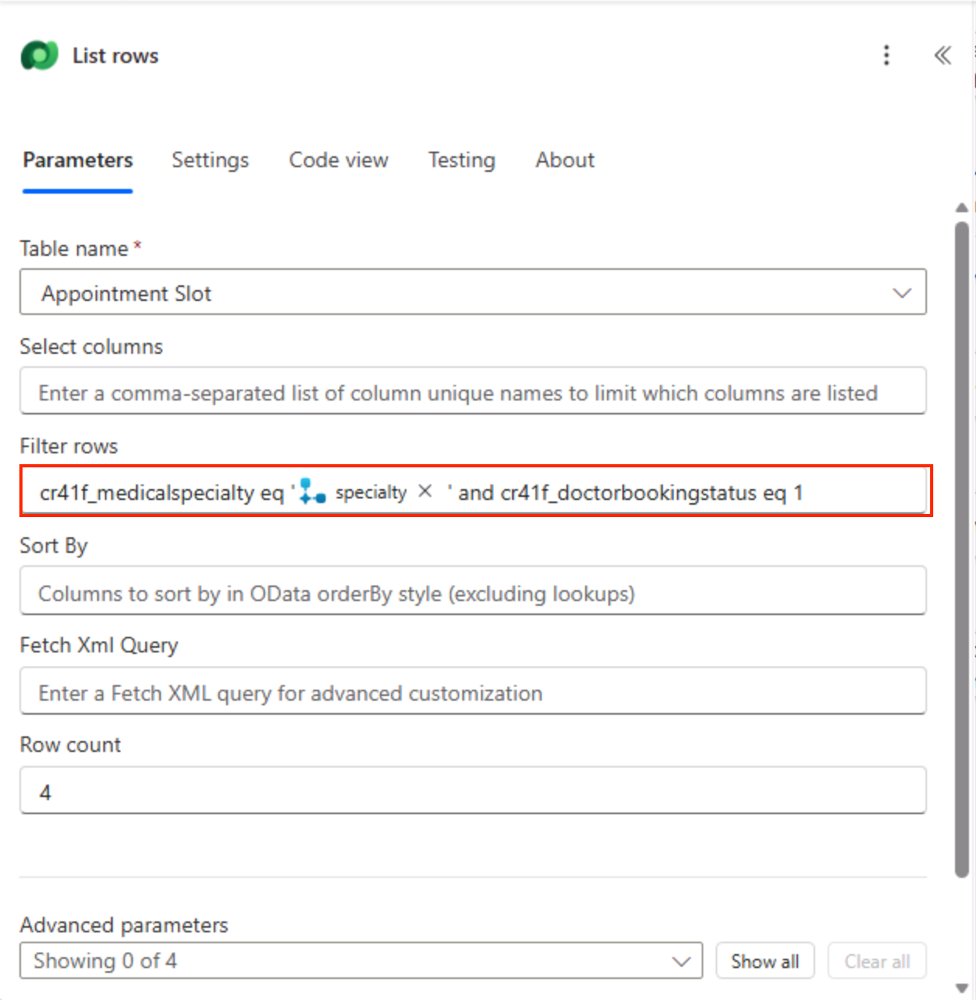

12. Enter the Row count as 4.

    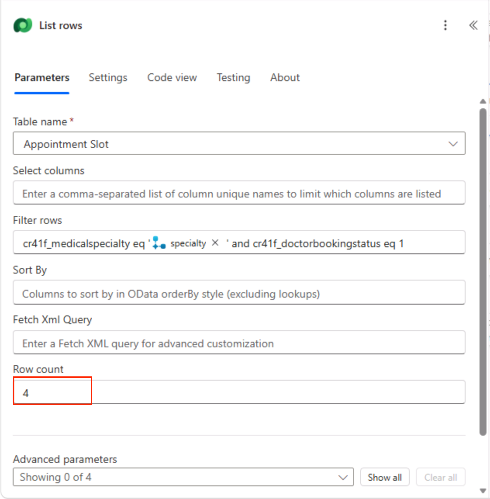

13. Click the **+ sign** below the previous node. Search +++search+++.

    

14. In From section, select thunderbolt icon -\> select body/value.

    

15. Switch to text mode.

    

16. Select the **fx** and enter the following expression:
    ```
    concat(
    '📅 Appointment',
    decodeUriComponent('%0A'),
    'Date: ',
    formatDateTime(item()?['cr41f_appointmentdateandtime'], 'dd MMM yyyy'),
    decodeUriComponent('%0A'),
    'Time: ',
    formatDateTime(item()?['cr41f_appointmentdateandtime'], 'hh:mm tt'),
    decodeUriComponent('%0A'),
    '👨‍⚕️ Doctor: ',
    item()?['cr41f_clinicianname'],
    decodeUriComponent('%0A'),
    '📍 Location: ',
    item()?['cr41f_cliniclocation'],
    decodeUriComponent('%0A'),
    '🆔 Slot ID: ',
    item()?['cr41f_slotidentifier'],
    decodeUriComponent('%0A'),
    '────────────────────────'
    )

    ```
    Click **Add**.

    **Note:** The Dataverse schema prefix (for example, **cr14f**,
    **cr41f**, **crbab**, etc.) is automatically generated when the table
    is created and **may be different in your environment**. Always verify
    the actual schema name of your columns before using them in Power
    Automate expressions

    

    

17. Click the **+ sign** below the previous node. Search for
    +++compose++++.

    

18. Select the **fx** and enter the following expression:

    ```
    concat(
        decodeUriComponent('%0A'),
        join(outputs('Select')?['body'], decodeUriComponent('%0A%0A'))
    )
    ```
    Select **Add**.

    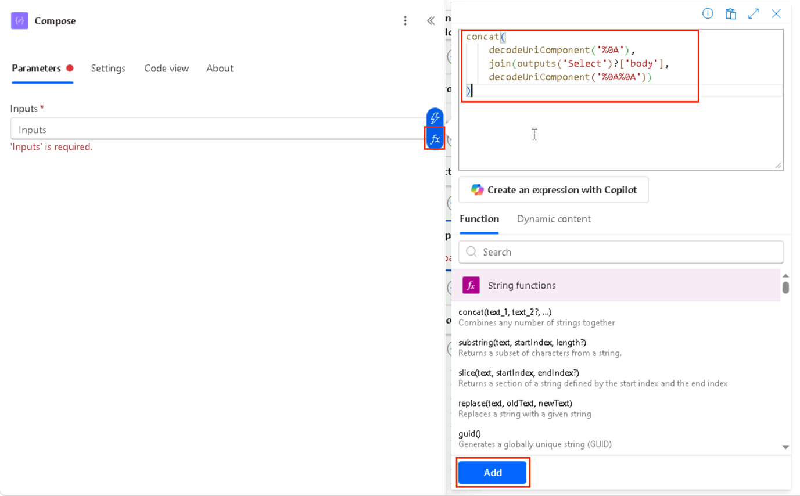

19. Click the **+ sign** below the previous node. Select **Respond to
    the agent** under AI capabilities.

    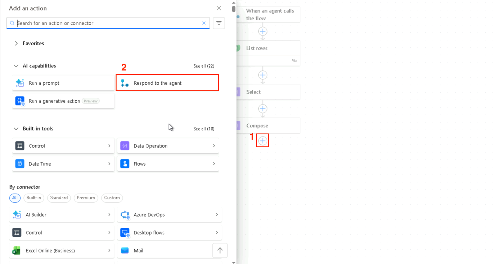

20. Select **+Add an Output**.

    

21. Select **Text**.

    

22. Enter +++ AppointmentSlots+++.

    

23. Select **Dynamic content** -\> select **Outputs** under **Compose**.

    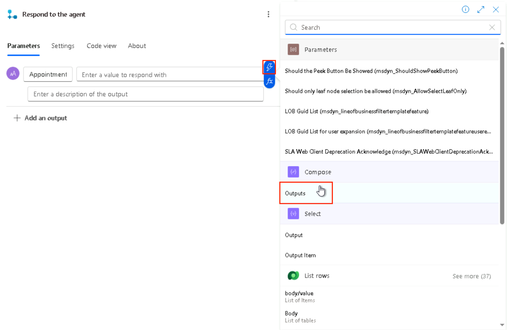

    

24. Click the **save** button to save the changes.

    

### Task 2: Connect the HC-SlotLookup Flow to the Agent

Integrate the HC-SlotLookup flow with the booking conversation so
patients can view available appointment slots directly within the chat.

1.  Navigate back to Copilot Studio.

2.  Select Agents-\> select Northstar Patient Assistant.

    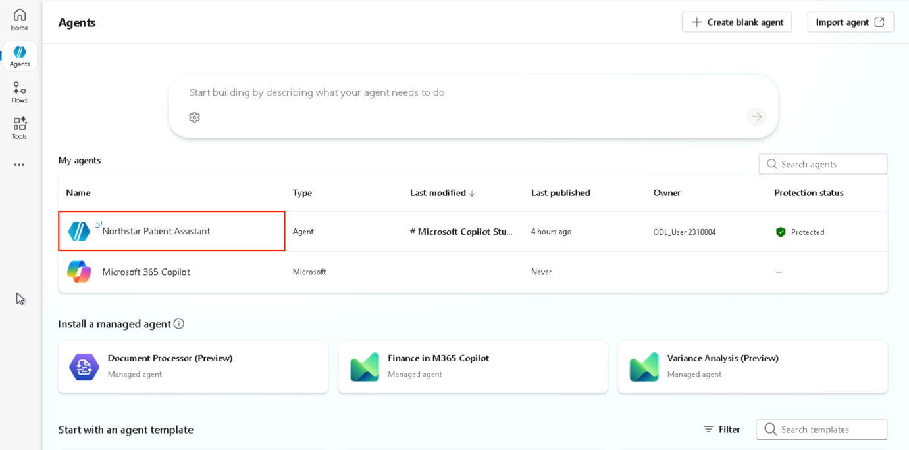

3.  Select Topics -\> open **Book Appointment** topic.

    

4.  After the” I can help you schedule your appointment, but I can't
    provide medical advice.” **Message** node, click + sign. Select
    **Add a tool -\>HC-SlotLookup.**

    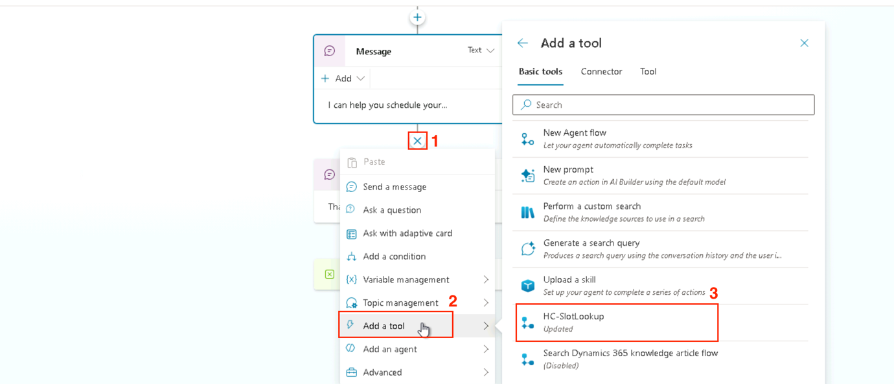

5.  In the Action tool, in the specialty field, click the three dots(…).
    Select **specialty** variable.

    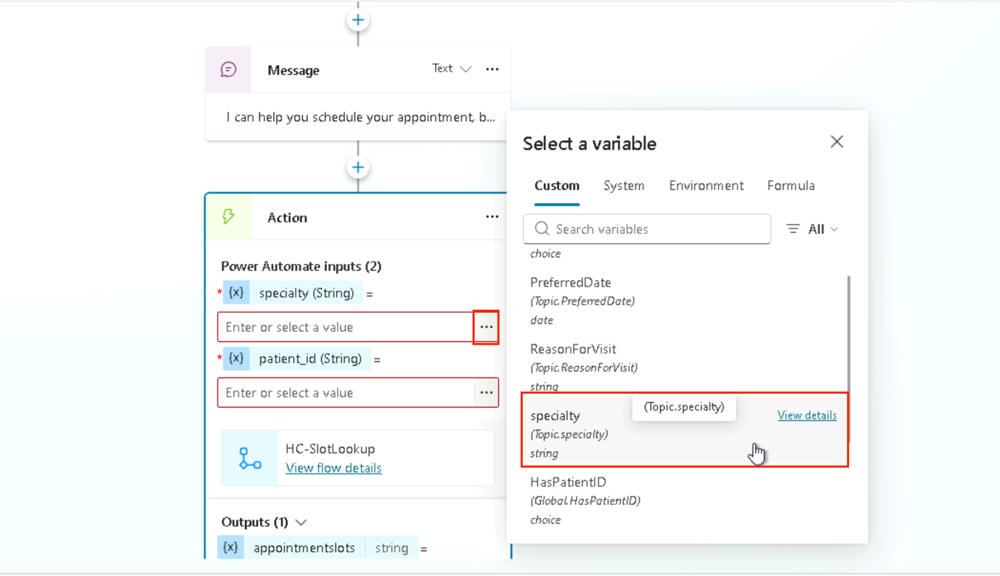

6.  Similarly, in the patient_id field, click the three dots(…). Select
    the **PatientID** variable.

    

7.  Under the Action node, click the (+) sign. Select **Send a
    message**.

8.  In the send a message node, Enter the following message:

    +++I found the following available appointments:+++

    Then select variable(X)-\>select AppointmentSlots variable.

    It will display all the available slots.

    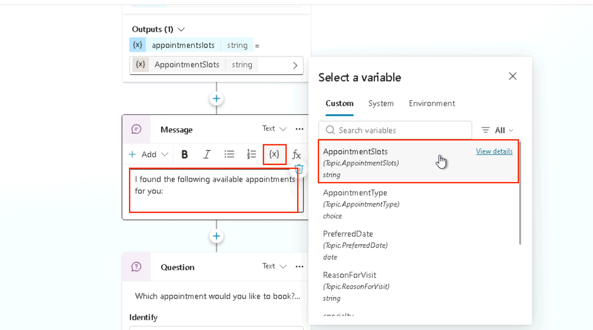

    

9.  Click the **+ sign** below the previous node. Select **Ask a
    question**.

    

10. Enter the following details:

    - Question: +++Which appointment would you like to book? Please enter
    the Slot ID.+++

    - Identify: Select **User’s entire response**

    - Save user response as +++selectedSlot+++

    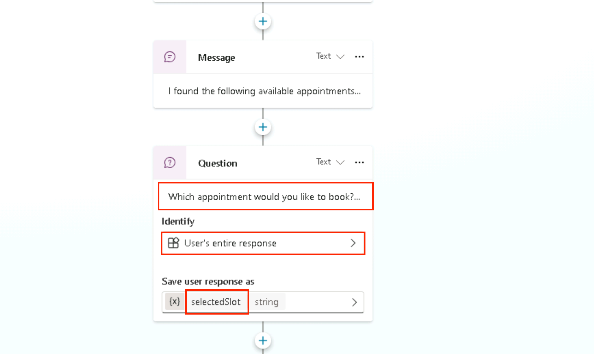

11. Select **Save** to save the updates.

### Task 3 — Build HC-BookAppointment Flow

Create a Power Automate flow that reserves the selected appointment
slot, updates Dataverse, and returns a booking confirmation.

1.  Open a new browser tab and navigate to
    **+++https://make.powerautomate.com+++**.

2.  Select **Create** from the left navigation menu, then choose
    **Instant cloud flow**.

    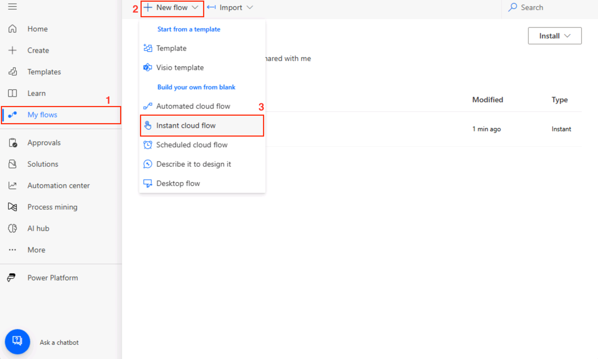

3.  Enter the flow name as **+++HC-BookAppointment+++**. Select the
    **When an agent calls the flow** trigger and click **Create**.

    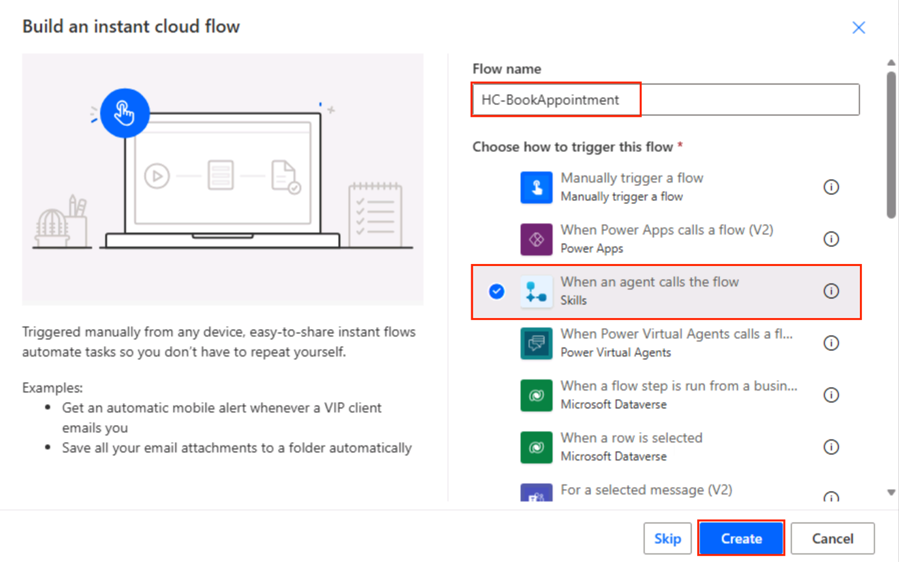

4.  Select the **When an agent calls the flow** trigger, then click **+
    Add an input**.

5.  Select **Text**.

6.  Enter the first input parameter name as:**+++slot_id+++**

7.  Click **+ Add an input** and create the following input parameters
    one by one:

    | **Name**                  | **Type** |
    |-----------------------|------|
    | +++patient_id+++         | Text |
    | +++patient_name+++       | Text |
    | +++date_of_birth+++       | Date |
    | +++specialty+++           | Text |
    | +++appointment_type+++    | Text |
    | +++reason_for_visit+++    | Text |

    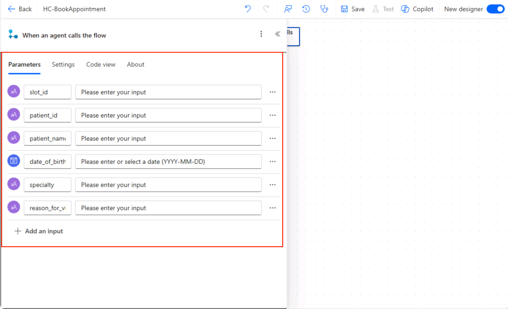

8.  Click the **+** sign below the trigger. Search for +++**List a
    row+++** and select **List rows** from **Microsoft Dataverse**.

    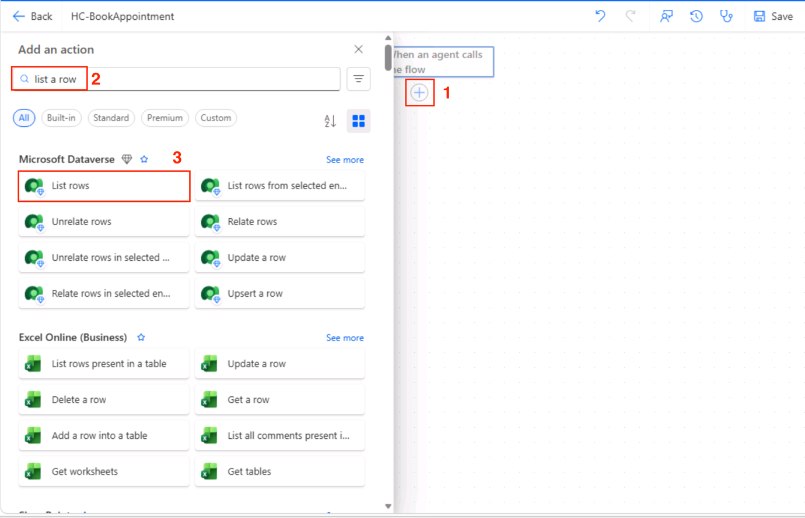

9.  If prompted, create a Dataverse connection.

10. Select the **Appointment Slot** table.

    

11. In the **Filter rows** field, enter the following expression:
    +++ppa_slotidentifier eq '+++ -\>Select **Dynamic content** and
    insert the **slot_id** parameter -\> +++’+++

    **Note:** The Dataverse schema prefix (for example, **cr14f**,
    **cr41f**, **crbab**, etc.) is automatically generated when the table
    is created and **may be different in your environment**. Always verify
    the actual schema name of your columns before using them in Power
    Automate expressions

    

    

12. Enter **1** in the **Row count** field.

    

13. Click the **+** sign below **List rows**. Search for **Apply to
    each** and select it.

    

14. In the **Select an output from previous steps** field, choose
    **value** from the **List rows** action.

    

    

15. Inside the **Apply to each** action, click **+ sign**. Search for
    **Update a row** and select **Update a row** from Microsoft
    Dataverse.

    

16. Select the **Appointment Slot** table.

    

17. For the **Row ID**, select **Appointment Slot** as the unique
    identifier from the current item returned by **List rows**.

    

18. Select Show all and update the following columns.

    | Dataverse Column   | Value to Select      | Where to Select It From                          |
    |--------------------|----------------------|--------------------------------------------------|
    | Doctor Status      | `Booked`             | Type/select the choice value manually            |
    | Patient ID         | `patient_id`         | When an agent calls the flow → `patient_id`      |
    | Patient Name       | `patient_name`       | When an agent calls the flow → `patient_name`    |
    | Date Of Birth      | `date_of_birth`      | When an agent calls the flow → `date_of_birth`   |
    | Medical Specialty  | `specialty`          | When an agent calls the flow → `specialty`       |
    | Reason For Visit   | `reason_for_visit`   | When an agent calls the flow → `reason_for_visit`|
    | Status             | `Confirmed`          | Select the choice value manually                 |

    

    

    

    

19. Click the **+** sign below the **Apply to each** action. Search for
    +++**Compose+++** and select **Compose**.

    

20. Enter manually:

    +++✅ Your appointment has been confirmed.

    Appointment Reference:+++

    Insert the **slot_id** dynamic content from **When an agent calls the
    flow**.

    Continue typing: +++Patient Name:+++

    Insert **patient_name** dynamic content.

    Continue typing: +++Specialty:+++

    Insert **specialty** dynamic content.

    Finally type: +++Status: Booked+++

    

21. Click the **+** sign below the **Compose** action. Select **Respond
    to the agent**.

    

22. Click **+ Add an output**. Select **Text**.

23. Enter the output name as: +++BookingConfirmation+++

24. Select **Dynamic content**. Select **Outputs** from the **Compose**
    action.

    

    

25. Click **Save** to save the flow.

    

### Task 4 — Connect the HC-BookAppointment Flow to the Agent

Integrate the booking flow with the conversation so appointment requests
are automatically processed and confirmed.

1.  Navigate back to Copilot Studio.

2.  Select Agents from the left-navigation panel and then open the
    **Northstar Patient Assistant** agent.

    

3.  Select **Topics** -\> Open the **Book Appointment** topic.

    

4.  In the Book Appointment topic, Locate the question: **“Which
    appointment would you like to book? Please enter the Slot ID.”**

5.  Click the + **sign** immediately below this question. Select **Add a
    tool** -\>Select **HC-BookAppointment**.

    

6.  Map the following variables.

    | Flow Input          | Agent Variable    |
    |---------------------|-------------------|
    | `slot_id`           | `selectedSlot`    |
    | `patient_id`        | `PatientID`       |
    | `patient_name`      | `PatientName`     |
    | `date_of_birth`     | `DateOfBirth`     |
    | `specialty`         | `specialty`       |
    | `appointment_type`  | `AppointmentType` |
    | `reason_for_visit`  | `ReasonForVisit`  |

    Verify that all input parameters have been mapped correctly.

    

    

7.  Replace the previous placeholder message. Select {X} to add new
    variable -\> Select **BookingConfirmation** output returned by the
    flow.

    

    

8.  The message node should display the booking confirmation returned by
    Power Automate.

9.  Click the + **sign** below the booking confirmation message node.
    Select Topic management-\>End current topic.

    

10. Select **Save**.

    

11. Select **Publish**, then select **Publish** again to publish the
    latest changes.

### Task 5 —Test the End-to-End Appointment Booking Experience

Validate the complete appointment booking process and verify that
booking details are correctly stored in Dataverse.

1.  Select Test to test the agent.

2.  Enter the following prompt:

    **+++I want to book an appointment.+++**

    

3.  Enter the follow up questions:

    - Enter your Patient ID: +++NH2201+++

    - Please enter your date of birth: +++1985-11-02+++

    - Please enter your name: +++James Ortiz+++

    - Which speciality would you like to book an appointment with:
    +++Orthopaedics +++

    - Is this your first visit or a follow-up appointment: Select First
    Visit

    - Please briefly describe the reason for your appointment: +++I m
    feeling a little pain in my right Knee+++

    - Which appointment would you like to book? Please enter the Slot ID:
    +++APT1024+++.

    

    

    

    

4.  Navigate to +++ <https://make.powerapps.com/>+++ to verify the
    booking.

5.  Select Tables-\>Appointment slot.

    

6.  Select **+19 additional rows** to view all the rows.

    

7.  Locate Slot Id: APT1024 and you can see that the appointment is
    booked.

    

## Lab Summary

In this lab, you built an AI-powered healthcare appointment assistant
using Microsoft Copilot Studio, Microsoft Dataverse, and Power Automate.
You created a secure conversational experience that verifies patient
identity, answers hospital-related questions using organizational
knowledge, handles emergency scenarios responsibly, and enables patients
to book or cancel appointments.

You also automated the appointment management process by integrating
Power Automate flows with Copilot Studio, allowing the agent to retrieve
available appointment slots, update appointment records in Dataverse,
and return booking confirmations in real time. Finally, you validated
the complete end-to-end solution by testing patient interactions and
confirming successful appointment bookings.
