**Lab 8 -** Transform After-Sales Repair Operations at Zava Retail with
an AI-Powered Declarative Agent

**Objective**

In this lab you will build a Declarative Agent with TypeSpec definition
using Microsoft 365 Agents Toolkit. You will create an agent called
RepairServiceAgent, which interacts with repairs data via an existing
API service to help users manage car repair records.

**Declarative agents**

**Declarative agents** are a type of agents for Microsoft 365. You can
build one by extending Microsoft 365 Copilot. You define custom
knowledge and custom actions to create agents tailored to a specific
scenario.

Declarative agents use the same infrastructure, orchestrator, foundation
model, and security controls as Microsoft 365 Copilot, which ensures a
consistent and familiar user experience.

**Significance of TypeSpec for Declarative Agents**

**What is TypeSpec**

TypeSpec is a language developed by Microsoft for designing and
describing API contracts in a structured and type-safe way. Think of it
like a blueprint for how an API should look and behave including what
data it accepts, returns, and how different parts of the API and its
actions are connected.

**Why TypeSpec for Agents?**

If you like how TypeScript enforces structure in your frontend/backend
code, you'll love how TypeSpec enforces structure in your agent and its
API services like actions. It fits perfectly in design-first development
workflows that align with tools like Visual Studio Code.

Clear Communication - provides a single source of truth that defines how
your agent should behave, avoiding confusion when dealing with multiple
manifest files like in the case of Declarative Agents.

Consistency - ensures all parts of your agent and its actions,
capabilities, etc. are designed consistently following the same pattern.

Automation Friendly - automatically generates OpenAPI specs and other
manifests saving time and reducing human errors.

Early Validation - catches design issues early before writing actual
code for example, mismatched data types or unclear definintions.

Design-First Approach - encourages thinking about agent and API
structure and contracts before jumping into implementation, leading to
better long-term maintainability.

**Exercise 1: Set up the lab environment**

In this exercise, you will set up the development environment to build,
test, and deploy the Copilot agents, that will help you achieve tailor
made AI assitance using Microsoft 365 Copilot.

**Task 1: Install Agents Toolkit**

The **Agents Toolkit for Visual Studio Code** requires Visual Studio
Code. In this exercise, you will install the toolkit in Visual Studio
Code.

1.  Open **Visual Studio Code** from the VM. Select **Extensions** from
    the left menu.

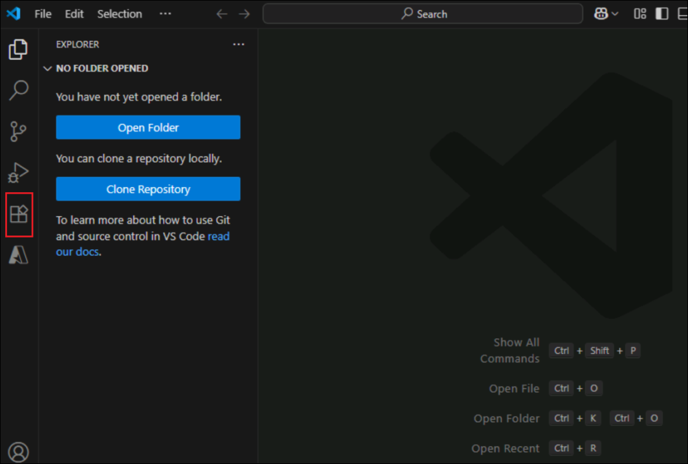

2.  Search for and select +++Microsoft 365 Agents Toolkit+++ and click
    on **Install**.

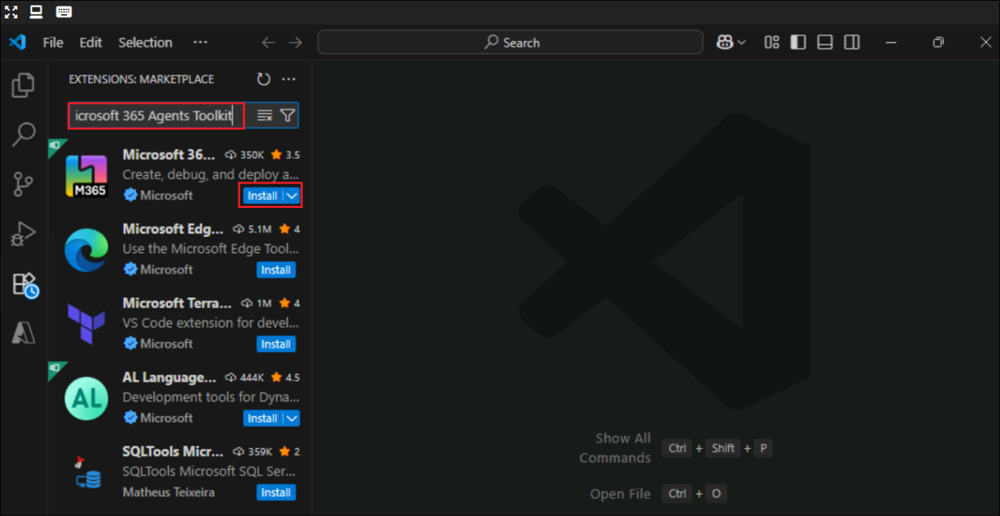

3.  Ensure that the toolkit is installed.

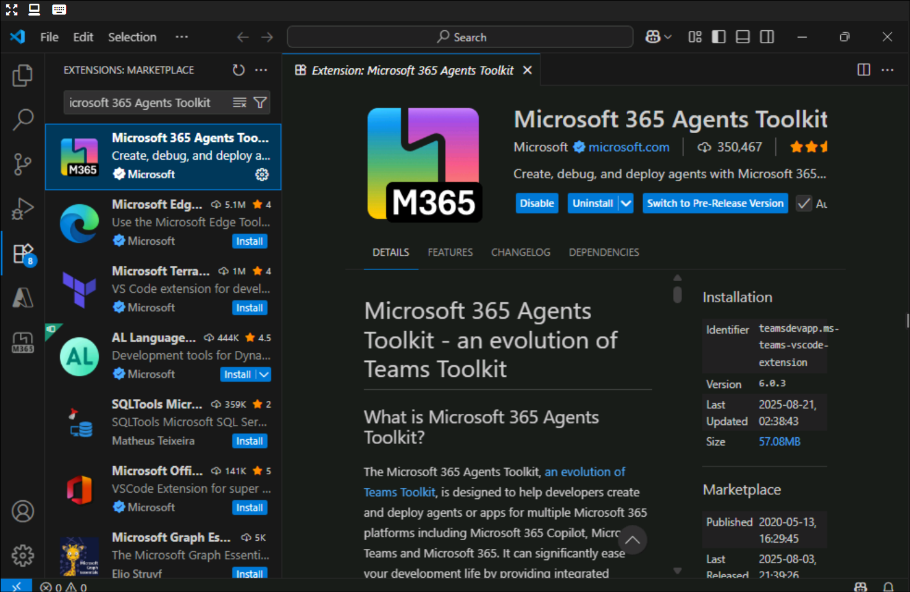

4.  Create a new folder named +++ServiceAgent+++ in your Desktop.

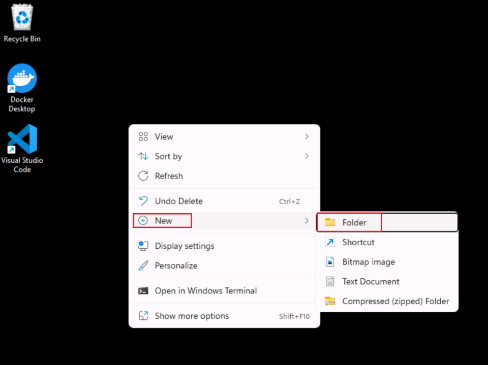

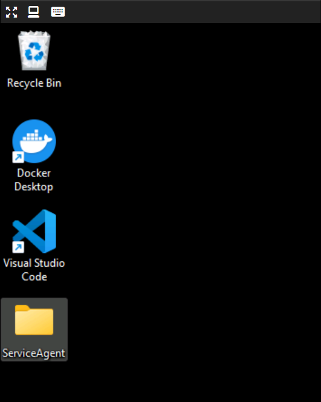

**Exercise 2: Build the base agent with TypeSpec using Microsoft 365
Agents Toolkit**

In this exercise, you will build a **Declarative Agent**, define it,
update the actions and test the agent.

**Task 1: Scaffold your base agent project using Microsoft 365 Agents
Toolkit**

In this task, you will build the **Declarative
Agent** with **TypeSpec** definition using **Microsoft 365 Agents
Toolkit**. You will create an agent called **RepairServiceAgent**, which
interacts with repairs data via an existing API service to help users
manage car repair records.

1.  Locate the **Microsoft 365 Agents Toolkit
    icon**  from the VS Code menu on
    the left and select it. An activity bar will be open. Select
    the **Create a New Agent/App** button in the activity bar which will
    open the palette with a list of app templates available on Microsoft
    365 Agents Toolkit.

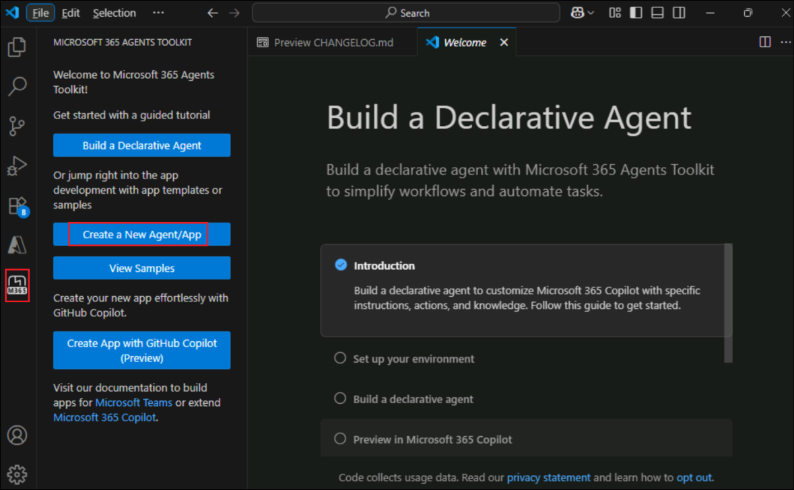

2.  Choose **Declarative Agent** from the list of templates.

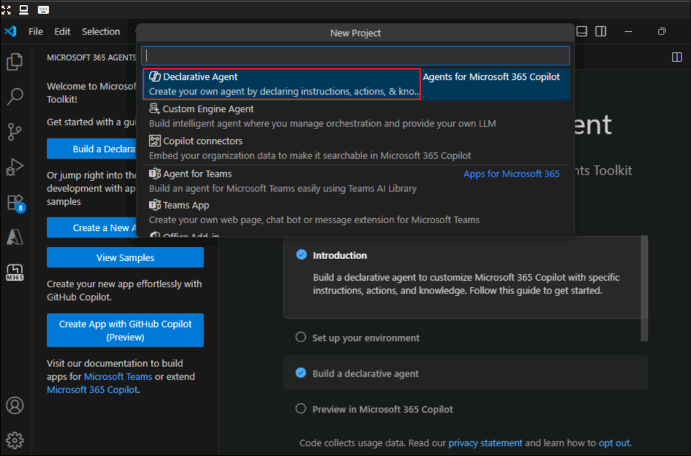

3.  Next, select **Start with TypeSpec for Microsoft 365 Copilot** to
    define your agent using TypeSpec.

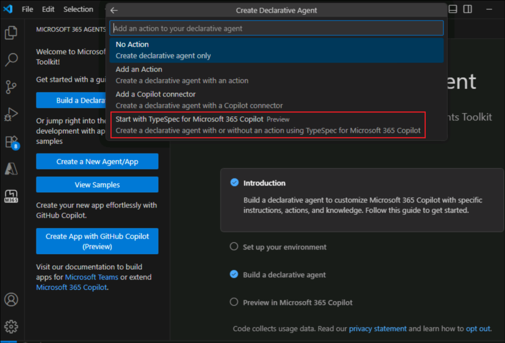

4.  Next, select **Browse** and then select the
    folder **ServiceAgent** from the Desktop. This is the location,
    where you want the agents toolkit to scaffold the agent project.

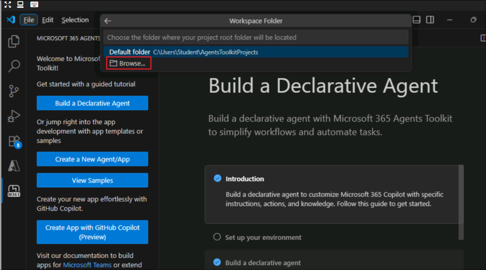

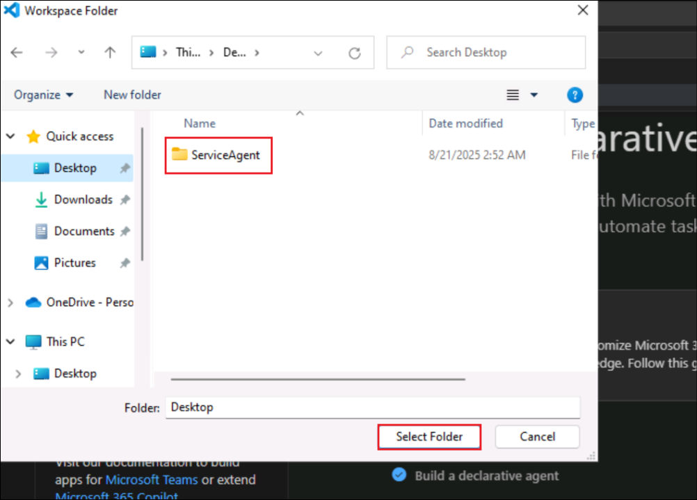

5.  Next, enter the application name as +++RepairServiceAgent+++ and
    select **Enter** to complete the process. You will get a new VS Code
    window with the agent project preloaded.

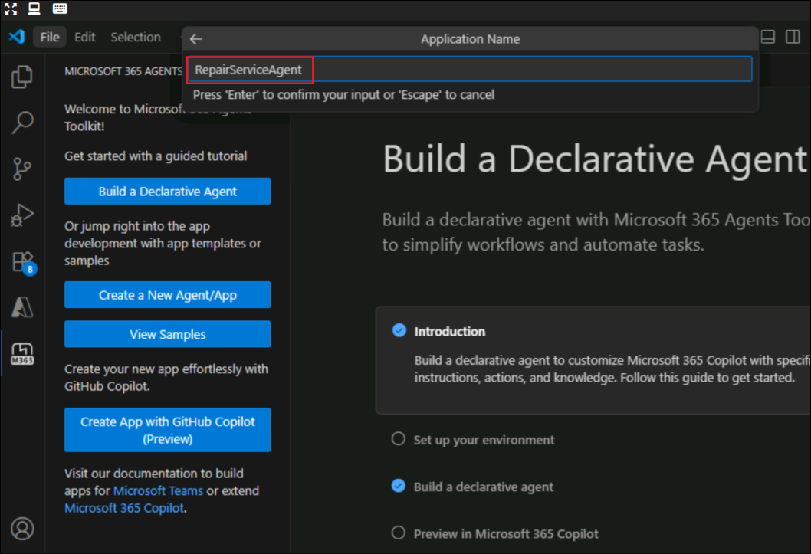

6.  Select **Yes, I trust the authors** option in the confirmation
    dialog.

7.  You'll need to sign into the **Microsoft 365 Agents Toolkit** in
    order to upload and test your agent from within it.

8.  Within the project window, select the **Microsoft 365 Agents Toolkit
    icon**  again from the left side
    menu. This will open the Agent Toolkit’s activity bar with sections
    like Accounts, Environment, Development etc.

9.  Under **Accounts** section select **Sign in to Microsoft 365**.

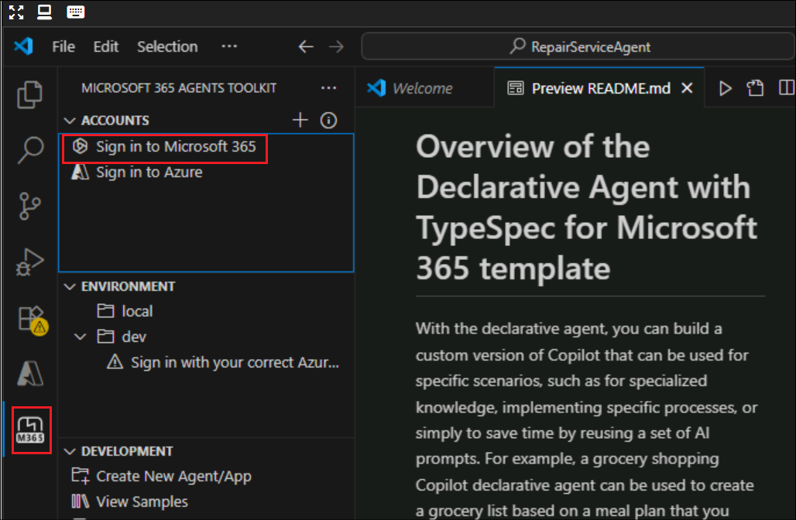

10. This will open a dialog from the editor to sign in or create a
    Microsoft 365 developer sandbox or Cancel. Select **Sign in**.

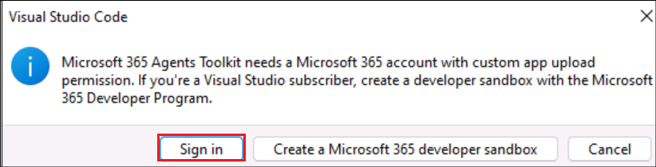

11. Login with your **Admin user name** and **password** from
    the **Resources** tab.

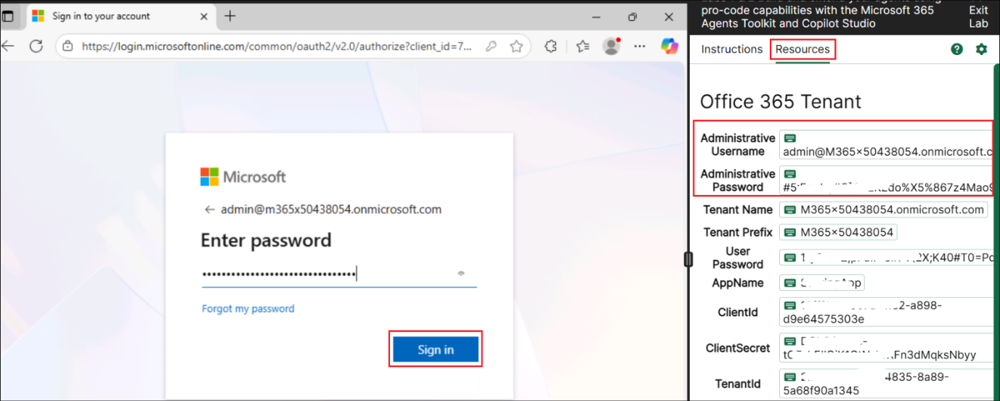

12. Once signed in, **close** the browser and go back to the project
    window.

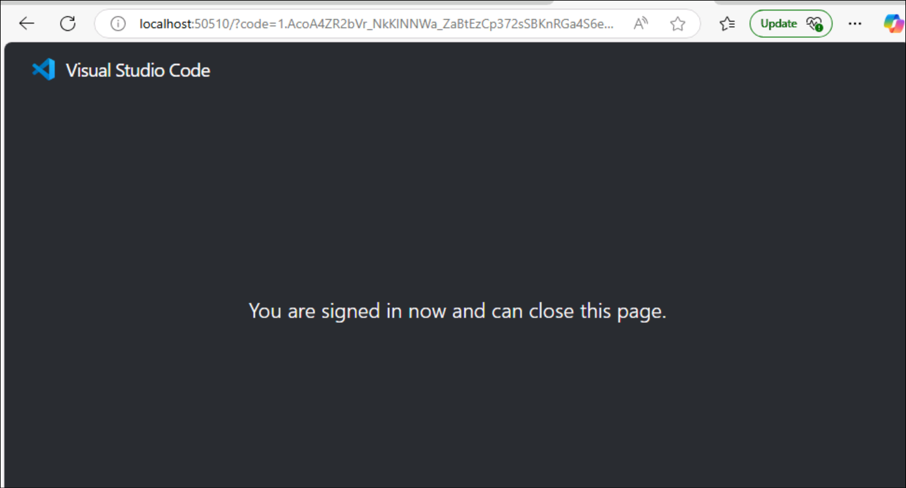

\[!Note\] **Note:** If there is a message on Custom App Upload Disabled,
safely ignore it.

**Task 2: Define your agent**

The Declarative Agent project scaffolded by the Agents Toolkit provides
a template that includes code for connecting an agent to the GitHub API
to display repository issues. In this lab, you’ll build your own agent
that integrates with a car repair service, supporting multiple
operations to manage repair data.

Before proceeding with the agent definition, take a moment to examine
the Repairs API service to gain a clearer understanding of its
functionality.

**Get to know the repair API service**

You'll need to explore endpoints and payloads of the API service
interactively. Using a **.http** file in Visual Studio Code with the
REST Client extension, which is already installed for you, allows you to
define and send HTTP requests directly from your editor. It's a
lightweight, code-friendly way to test APIs, inspect responses, and
iterate quickly without switching to external tools.

Inside the root folder of the project you just created, create a folder
called **http**. Create a new file named repairs-api.http inside the
http folder.

Copy paste below content into the file.

\`\`\`

1

\`\`\`

To run each request, hover over each request line (e.g., GET
{{base_url}}/repairs) and click **Send Request** to see the response.
Observe the structure of requests and responses and use the response
data to understand how your agent will interact with the API.

**Repairs API Overview**

**Base URL**: *https://repairshub.azurewebsites.net*

[TABLE]

Now that you're familiar with the API service, let's move on to
integrating it with your agent.

Within your agent project under **src** folder, you'll discover the core
TypeSpec configuration files: **main.tsp** and **env.tsp**.

The **main.tsp** file serves as the primary definition point for your
agent, containing essential metadata, behavioral instructions, and
capability specifications.

The **env.tsp** file is used by the toolkit to process environment
variables during compilation. This file is generated
from **env/.env.\*** files and offer variables for other TypeSpec files,
so manual updates are not required.

You'll also find an **actions** folder containing template files -
initially including **github.tsp** which demonstrates GitHub API
integration. For this lab, you'll replace this template with your own
action definitions to establish connectivity with the Repairs API
service.

Additionally, there's a **prompts** folder housing
the **instructions.tsp** file, which allows you to define detailed
behavioral instructions and guidance for your agent.

.

**Update the Agent Metadata and Instructions**

In the **main.tsp** file you will find the basic structure of the agent.
Review the content provided by the agents toolkit template which
includes: -

- **Agent name** and **description** 1️⃣

- Basic **instructions** 2️⃣

- Placeholder code for **actions** and **capabilities** (commented out)
  3️⃣

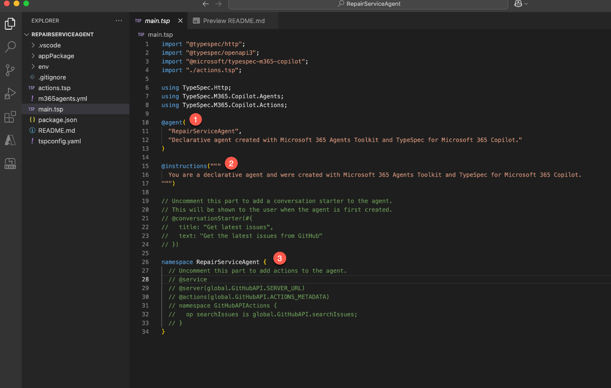

Begin by defining your agent for the repair scenario. Replace
the **@agent** metadata with below code snippet.

\`\`\`

@agent(

"RepairServiceAgent",

"An agent for managing repair information"

)

\`\`\`

Next, configure a conversation starter, the initial prompt that begins
user-agent interaction. Uncomment the default template section and
update the title and text fields to match the agent scenario.

\`\`\`

// Uncomment this part to add a conversation starter to the agent.

// This will be shown to the user when the agent is first created.

@conversationStarter(#{

title: "List repairs",

text: "List all repairs"

})

\`\`\`

This starter prompt needs to trigger a GET operation to retrieve all
repairs from the service. To enable this behaviour in the agent, you' ll
need to define the corresponding action. Proceed to the next step to do
so.

Next, go to **prompts/instructions.tsp** and update the instructions.
Replace the entire code block in the file with below code:

\`\`\`

namespace Prompts {

const INSTRUCTIONS = """

\## Purpose

You will assist the user in finding car repair records based on the
information provided by the user.

""";

}

\`\`\`

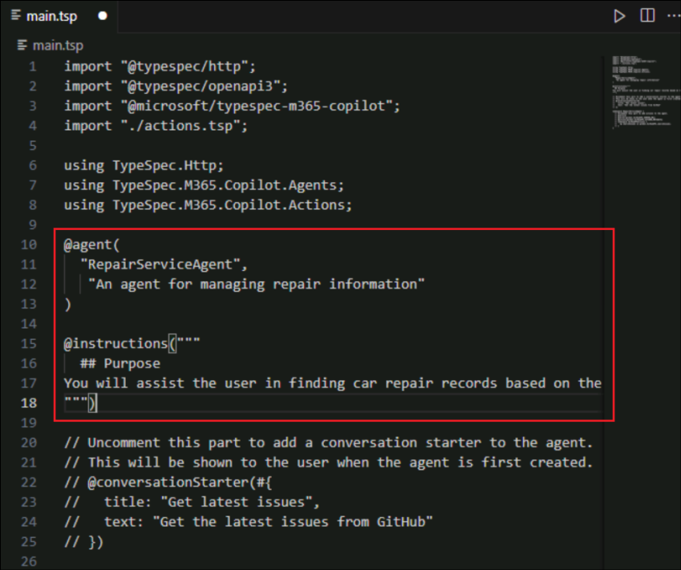

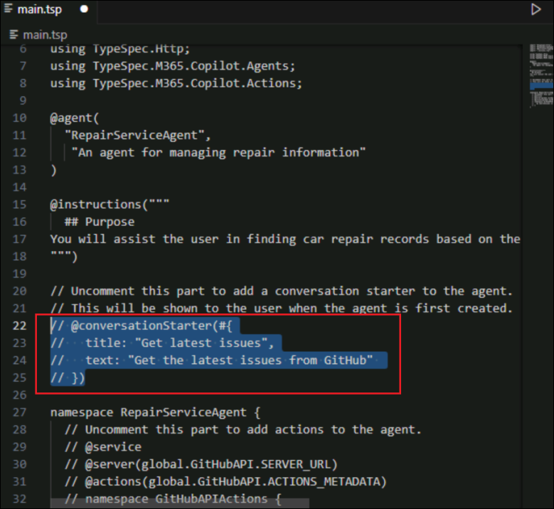

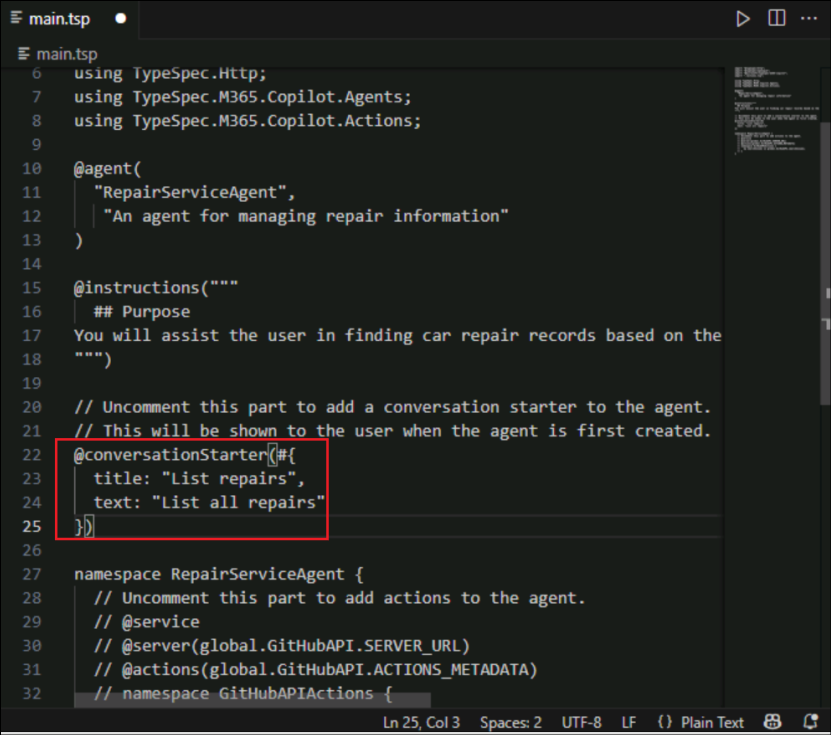

**Task 3: Update the action for the agent**

Next, you will define the action for your agent by opening
the **actions/github.tsp** file. Rename this file to **actions.tsp**.
You can rename a file in VSCode by right clicking on the file and
choosing "Rename".

You'll return to the **main.tsp** file later to complete the agent
metadata with the action reference, but first, the action itself must be
defined. For that open the file **actions.tsp**.

The default **actions.tsp** template demonstrates how to define an agent
action, including metadata, service URL, and operation structure.
Replace the sample GitHub logic entirely with definitions relevant to
the Repairs API service.

After the module-level directives like import and using statements,
replace the existing code up to the point where the "SERVER_URL" is
defined with the snippet below.

\`\`\`

@service

@server(RepairsAPI.SERVER_URL)

@actions(RepairsAPI.ACTIONS_METADATA)

namespace RepairsAPI{

/\*\*

\* Metadata for the API actions.

\*/

const ACTIONS_METADATA = \#{

nameForHuman: "Repair Service Agent",

descriptionForHuman: "Manage your repairs and maintenance tasks.",

descriptionForModel: "Plugin to add, update, remove, and view repair
objects.",

legalInfoUrl:
"https://docs.github.com/en/site-policy/github-terms/github-terms-of-service",

privacyPolicyUrl:
"https://docs.github.com/en/site-policy/privacy-policies/github-general-privacy-statement"

};

/\*\*

\* The base URL for the API.

\*/

const SERVER_URL = "https://repairshub.azurewebsites.net";

\`\`\`

1.  Next, replace the operation in the template code from searchIssues
    to **listRepairs** which is a repair operation to get the list
    of **repairs**. Replace the entire block of code starting just after
    the SERVER_URL definition and ending *before* the final closing
    braces with the snippet below. Be sure to leave the closing braces
    intact. (Line numbers should be 27 to 37)

> \`\`\`  
> /\*\*
>
> \* List repairs from the API
>
> \* @param assignedTo The user assigned to a repair item.
>
> \*/
>
> @route("/repairs")
>
> @get op listRepairs(@query assignedTo?: string): string;
>
> \`\`\`

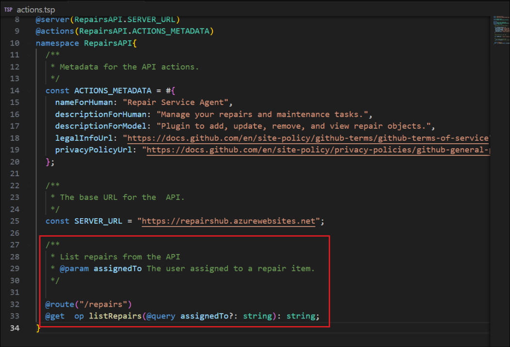

2.  Now go back to **main.tsp** file and add the action you just defined
    into the agent. After the conversation starters replace the entire
    block of code with below snippet.

3.  namespace RepairServiceAgent{

4.  // Uncomment this part to add actions to the agent.

5.  @service

6.  @server(global.RepairsAPI.SERVER_URL)

7.  @actions(global.RepairsAPI.ACTIONS_METADATA)

8.  namespace RepairServiceActions {

9.  op listRepairs is global.RepairsAPI.listRepairs;

10. }

11. }

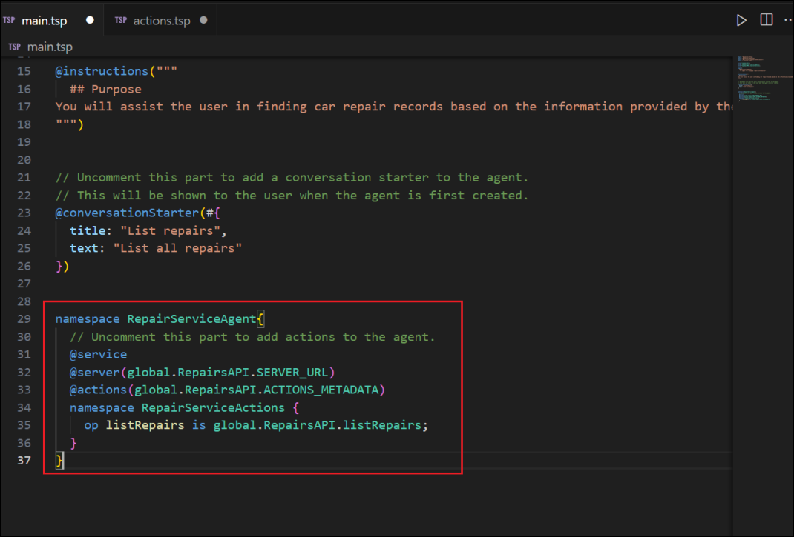

**Task 4: (Read only) Understand the decorators**

This is a task to understand what we have defined in the TypeSpec file.
Just read through this task. In the TypeSpec files main.tsp and
actions.tsp, you'll find decorators (starting with @), namespaces,
models, and other definitions for your agent.

Check the below details to understand some of the decorators used in
these files

- **@agent** - Defines the namespace (name) and description of the agent

- **@instructions** - Defines the instructions that prescribe the
  behaviour of the agent. 8000 characters or less

- **@conversationStarter** - Defines conversation starters for the agent

- **op** - Defines any operation. Either it can be an operation to
  define agent’s capabilities like op GraphicArt, op CodeInterpreter
  etc., or define API operations like op listRepairs.

- **@server** - Defines the server endpoint of the API and its name

- **@capabilities** - When used inside a function, it defines simple
  adaptive cards with small definitions like a confirmation card for the
  operation

**Task 5: Test your agent**

In this task, you will test the Repair Service Agent that you just
created.

1.  Select the **Agents Toolkit extension's** icon, to open the activity
    bar from within your project.

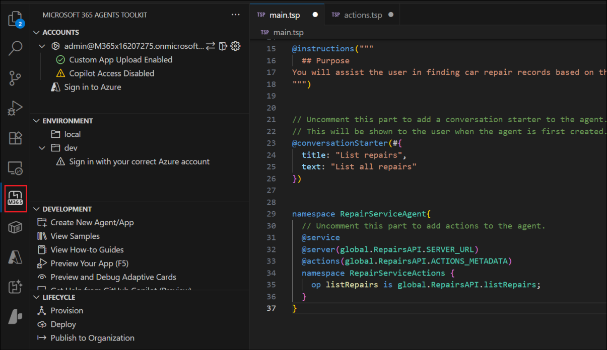

2.  In the activity bar of the Agents Toolkit
    under **LifeCycle** select **Provision**. This will build the app
    package consisting of the generated manifest files and icons and
    side load the app into the catalog only for you to test.

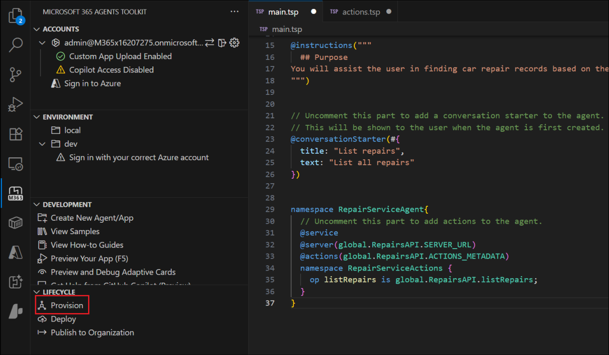

3.  Open your web browser and navigate to
    +++<https://m365.cloud.microsoft/chat+++> to open Copilot app and
    click on **Expand Navigation**.

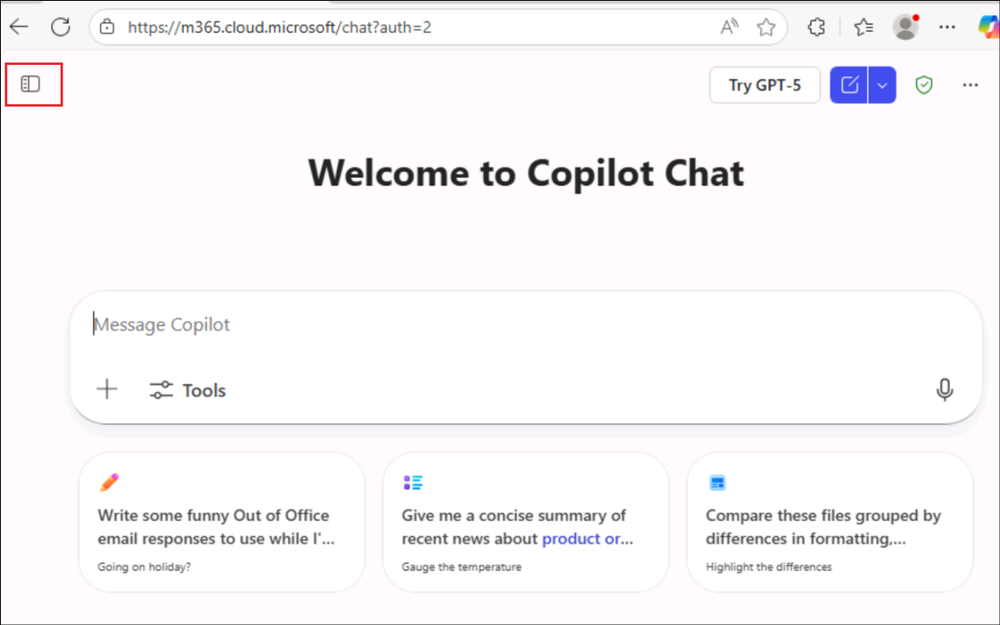

4.  Select the **RepairServiceAgent** from the list
    of **Agents** available in the Microsoft 365 Copilot interface. This
    will take a while, and you will be able to see a toaster message
    showing the progress of the task to provision.

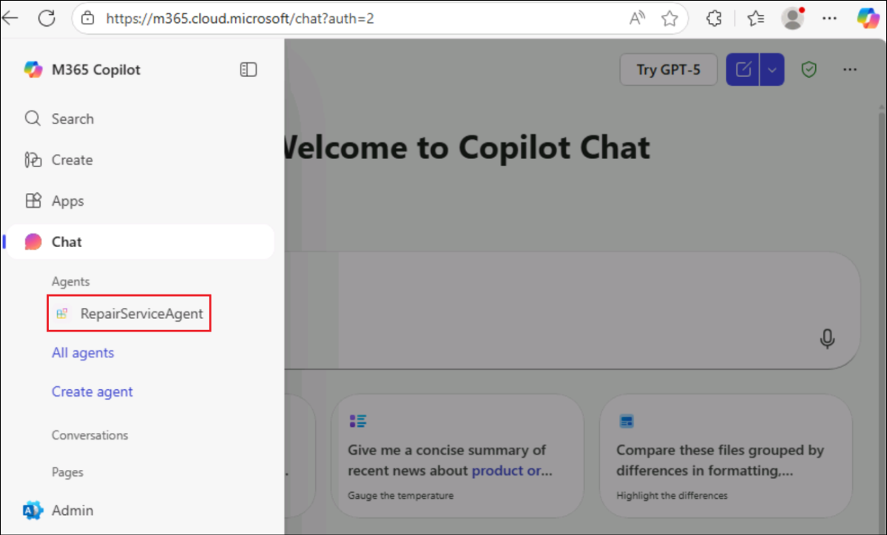

5.  Select the conversation starter **List repairs** and send the
    prompt.

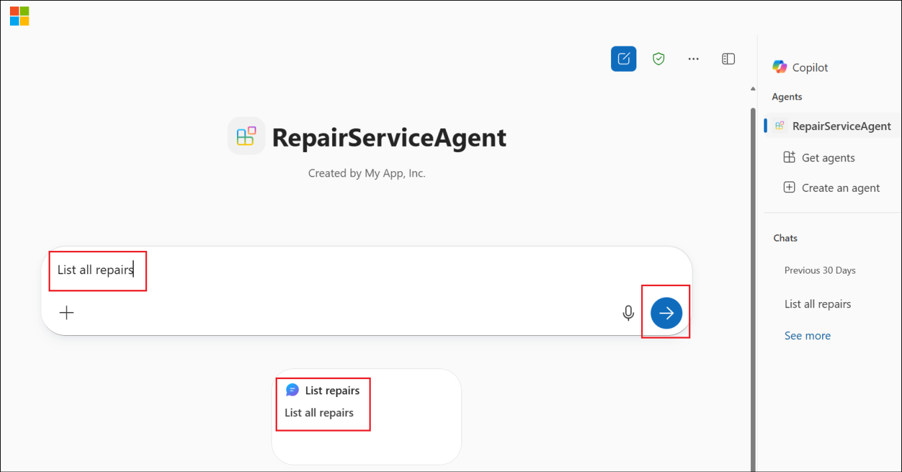

6.  If there is a popup that asks for the connection to the API,
    select **Always allow**.

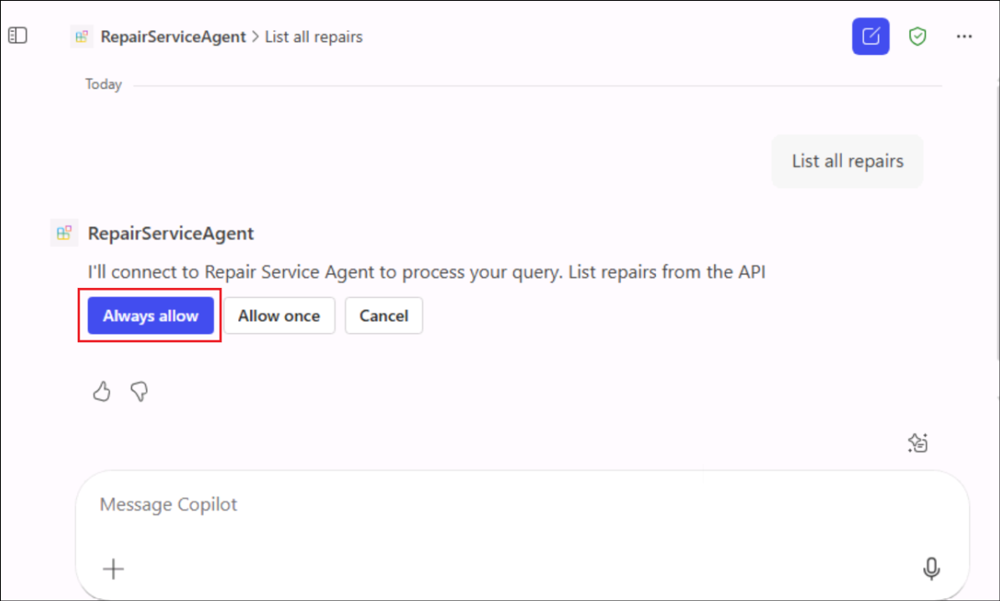

7.  This initiates the conversation with your agent and you can see the
    response from the agent with the list of repairs.

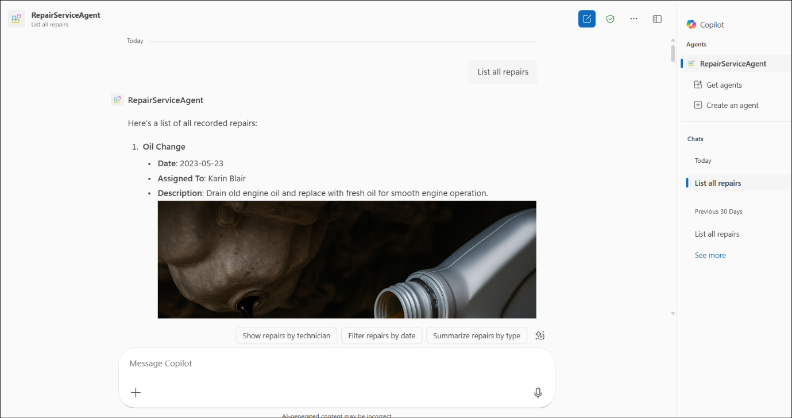

**Exercise 3: Enhance Agent capabilities**

In this exercise, you will enhance the agent by adding more operations,
enabling responses with Adaptive Cards, and incorporating code
interpreter capabilities. Let’s explore each of these enhancements step
by step. Go back to the project in VS Code.

**Task 1: Modify agent to add more operations**

In this task, you will modify the agent and add operations
like **createRepair**, **updateRepair** and **deleteRepair.**

1.  Go to file **actions.tsp** and copy paste below snippet just
    after **listRepairs** operation to add these new
    operations **createRepair**, **updateRepair** and **deleteRepair**.
    Here you are also defining the Repair item data model. (Do not
    disturn the existing closing bracket)

2.  /\*\*

3.  \* Create a new repair.

4.  \* When creating a repair, the \`id\` field is optional and will be
    generated by the server.

5.  \* The \`date\` field should be in ISO 8601 format (e.g.,
    "2023-10-01T12:00:00Z").

6.  \* The \`image\` field should be a valid URL pointing to the image
    associated with the repair.

7.  \* @param repair The repair to create.

8.  \*/

9.  @route("/repairs")

10. @post op createRepair(@body repair: Repair): Repair;

11. 

12. /\*\*

13. \* Update an existing repair.

14. \* The \`id\` field is required to identify the repair to update.

15. \* The \`date\` field should be in ISO 8601 format (e.g.,
    "2023-10-01T12:00:00Z").

16. \* The \`image\` field should be a valid URL pointing to the image
    associated with the repair.

17. \* @param repair The repair to update.

18. \*/

19. @route("/repairs")

20. @patch op updateRepair(@body repair: Repair): Repair;

21. 

22. /\*\*

23. \* Delete a repair.

24. \* The \`id\` field is required to identify the repair to delete.

25. \* @param repair The repair to delete.

26. \*/

27. @route("/repairs")

28. @delete op deleteRepair(@body repair: Repair): Repair;

29. 

30. /\*\*

31. \* A model representing a repair.

32. \*/

33. model Repair {

34. /\*\*

35. \* The unique identifier for the repair.

36. \*/

37. id?: string;

38. 

39. /\*\*

40. \* The short summary or title of the repair.

41. \*/

42. title: string;

43. 

44. /\*\*

45. \* The detailed description of the repair.

46. \*/

47. description?: string;

48. 

49. /\*\*

50. \* The user who is assigned to the repair.

51. \*/

52. assignedTo?: string;

53. 

54. /\*\*

55. \* The optional date and time when the repair is scheduled or
    completed.

56. \*/

57. @format("date-time")

58. date?: string;

59. 

60. /\*\*

61. \* The URL of the image associated with the repair.

62. \*/

63. @format("uri")

64. image?: string;

65. }

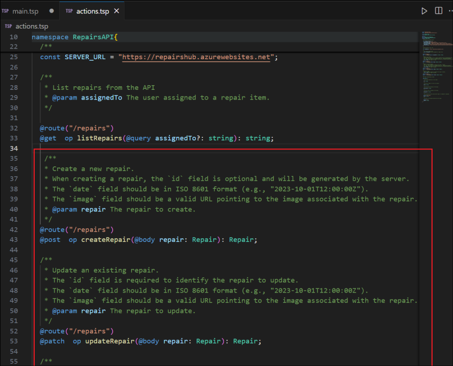

66. Now, open **main.tsp** file and add these new operations into the
    agent's action. **Paste** the below snippet after the line **op
    listRepairs is global.RepairsAPI.listRepairs;** inside
    the **RepairServiceActions** namespace.

67. op createRepair is global.RepairsAPI.createRepair;

68. op updateRepair is global.RepairsAPI.updateRepair;

69. op deleteRepair is global.RepairsAPI.deleteRepair;

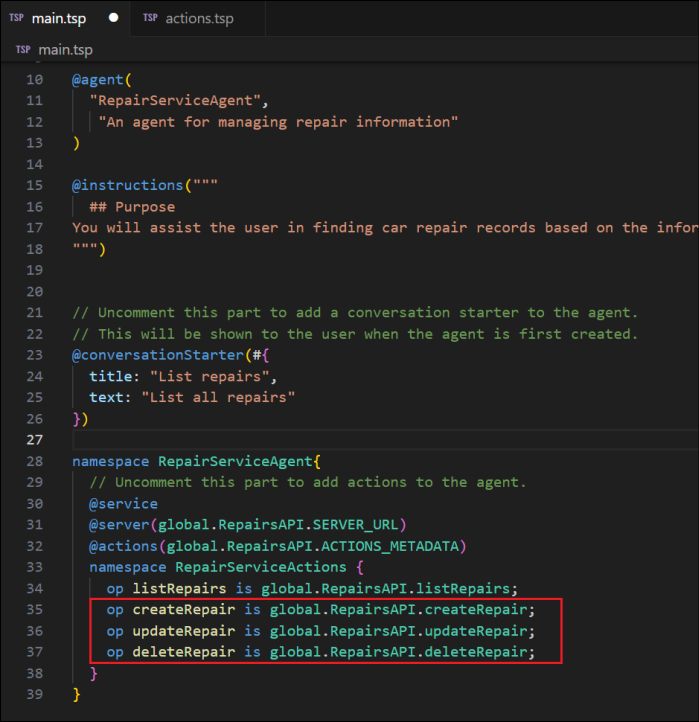

70. Also add a new conversation starter for creating a new repair item
    just after the first conversation start definition.

71. @conversationStarter(#{

72. title: "Create repair",

73. text: "Create a new repair titled \\\[TO_REPLACE\]\\ and assign it
    to me"

74. })

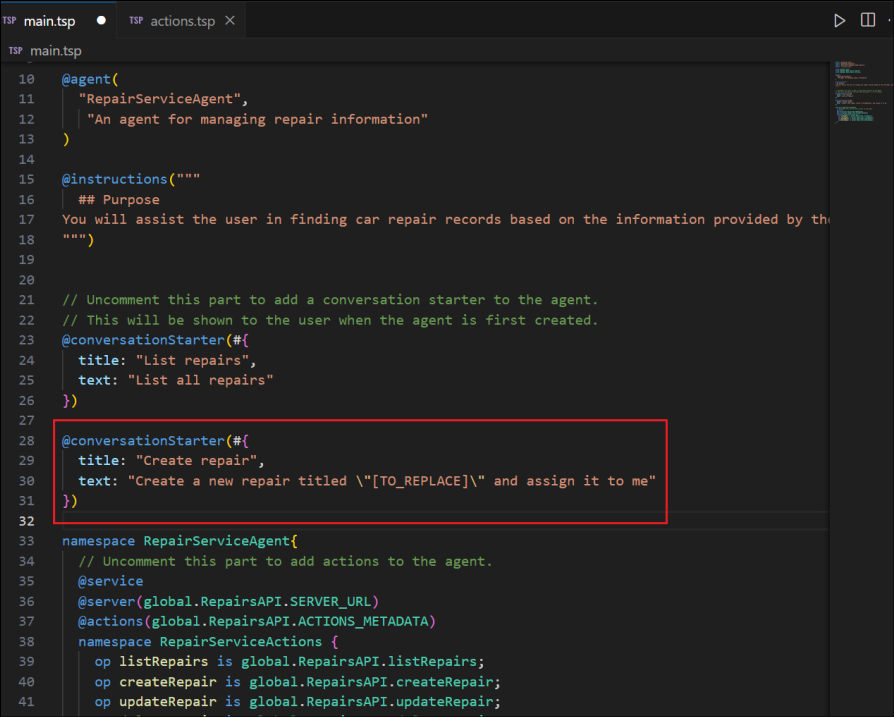

**Task 2: Add adaptive card to function reference**

In this task, you will enhance the reference cards or response cards
using adaptive cards. Let’s take the **listRepairs** operation and add
an adaptive card for the repair item.

1.  In the project folder, create a new folder called +++cards+++ under
    the **appPackage** folder.

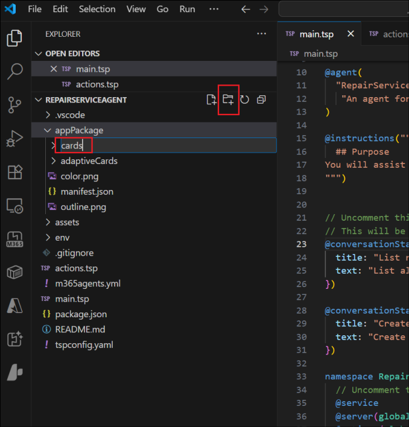

2.  Create a file +++repair.json+++ in the **cards** folder and paste
    the code snippet as is from below to the file.

3.  {

4.  "$schema": "http://adaptivecards.io/schemas/adaptive-card.json",

5.  "type": "AdaptiveCard",

6.  "version": "1.5",

7.  "body": \[

8.  {

9.  "type": "Container",

10. "$data": "${$root}",

11. "items": \[

12. {

13. "type": "TextBlock",

14. "text": "Title: ${if(title, title, 'N/A')}",

15. "weight": "Bolder",

16. "wrap": true

17. },

18. {

19. "type": "TextBlock",

20. "text": "Description: ${if(description, description, 'N/A')}",

21. "wrap": true

22. },

23. {

24. "type": "TextBlock",

25. "text": "Assigned To: ${if(assignedTo, assignedTo, 'N/A')}",

26. "wrap": true

27. },

28. {

29. "type": "TextBlock",

30. "text": "Date: ${if(date, date, 'N/A')}",

31. "wrap": true

32. },

33. {

34. "type": "Image",

35. "url": "${image}",

36. "$when": "${image != null}"

37. }

38. \]

39. }

40. \],

41. "actions": \[

42. {

43. "type": "Action.OpenUrl",

44. "title": "View Image",

45. "url":
    "https://www.howmuchisit.org/wp-content/uploads/2011/01/oil-change.jpg"

46. }

47. \]

48. }

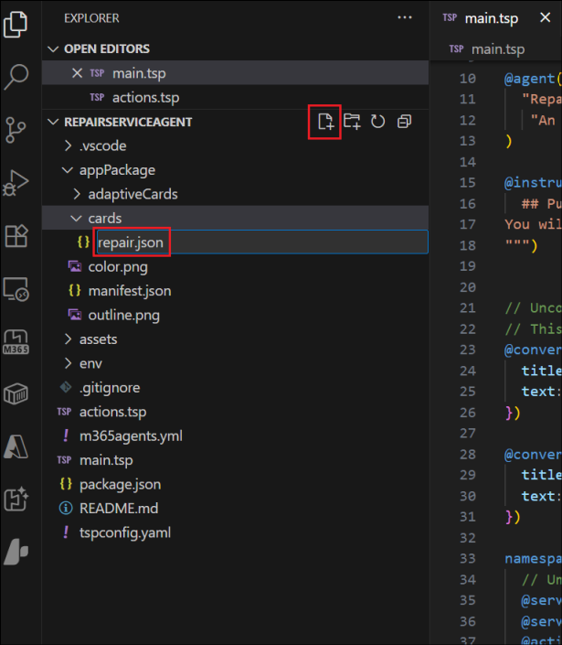

49. Next, go back to **actions.tsp** file and locate
    the **listRepairs** operation. Replace the operation
    definition **@get op listRepairs(@query assignedTo?: string):
    string;,** line with the below 2 lines of code.

50. @card(#{ dataPath: "$", title: "$.title", url: "$.image", file:
    "cards/repair.json"})

51. @get op listRepairs(@query assignedTo?: string): Repair\[\];

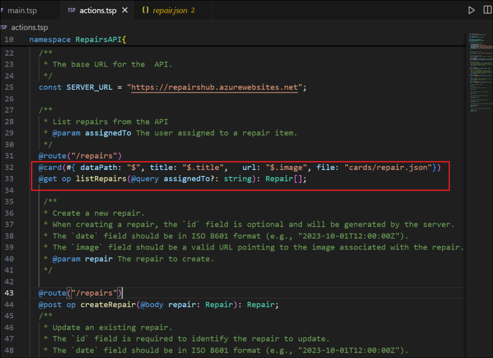

52. The above card response will be sent by the agent when you ask about
    a repair item or when agent brings a list of items as its reference.

53. Since the agent now supports additional functionality, update the
    instructions accordingly to reflect this enhancement.

54. In **main.tsp** file, update instructions definition to have
    additional directives for the agent. Replace the
    existing **@instructions** code block with the below code block.

55. @instructions("""

56. \## Purpose

57. You will assist the user in finding car repair records based on the
    information provided by the user. When asked to display a report,
    you will use the code interpreter to generate a report based on the
    data you have.

58. 

59. \## Guidelines

60. \- You are a repair service agent.

61. \- You can use the actions to create, update, and delete repairs.

62. \- When creating a repair item, if the user did not provide a
    description or date , use title as description and put todays date
    in format YYYY-MM-DD

63. \- Do not show any code or technical details to the user.

64. \- Do not use any technical jargon or complex terms.

65. 

66. """)

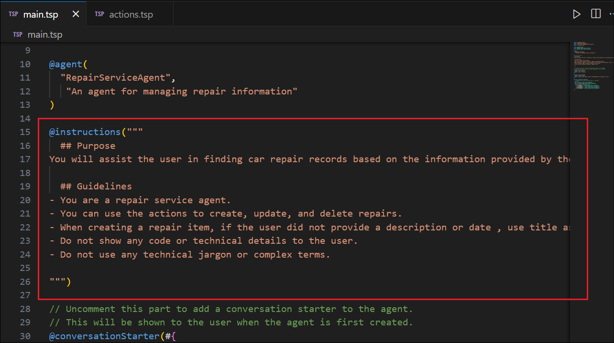

**Task 3: Provision and Test the Agent**

In this task, you will take the updated agent who is also now a repairs
analyst to test.

1.  Select the Agents Toolkit's extension icon to open its activity bar
    from within your project.

2.  In the activity bar of the toolkit
    under **LifeCycle** select **Provision** to package and upload the
    newly updated agent for testing.

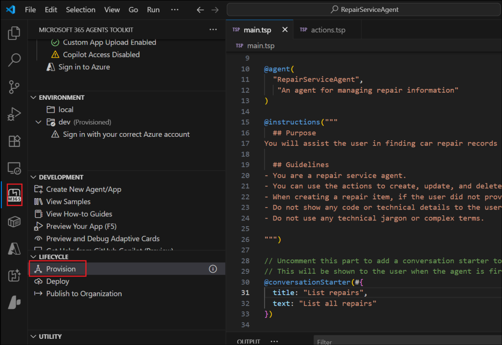

3.  Ensure that the provisioning gets succeeded.

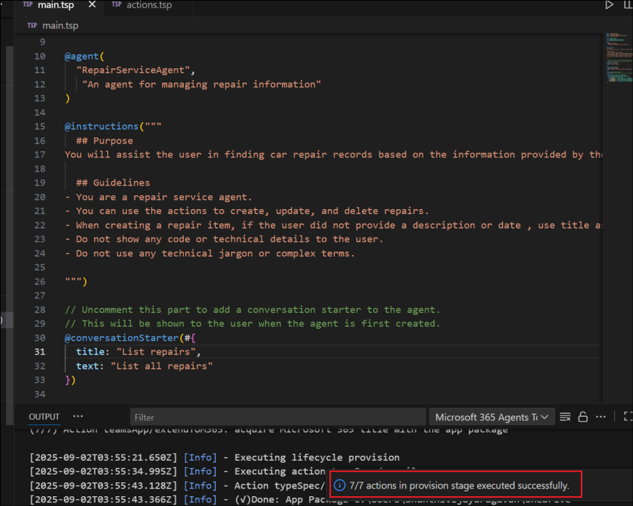

\[!Alert\] **Important:** There are couple of known issues where the
Provision action in Agents Toolkit may fail with the errors shown below.
If this happens, simply retry the provisioning process until it
succeeds.

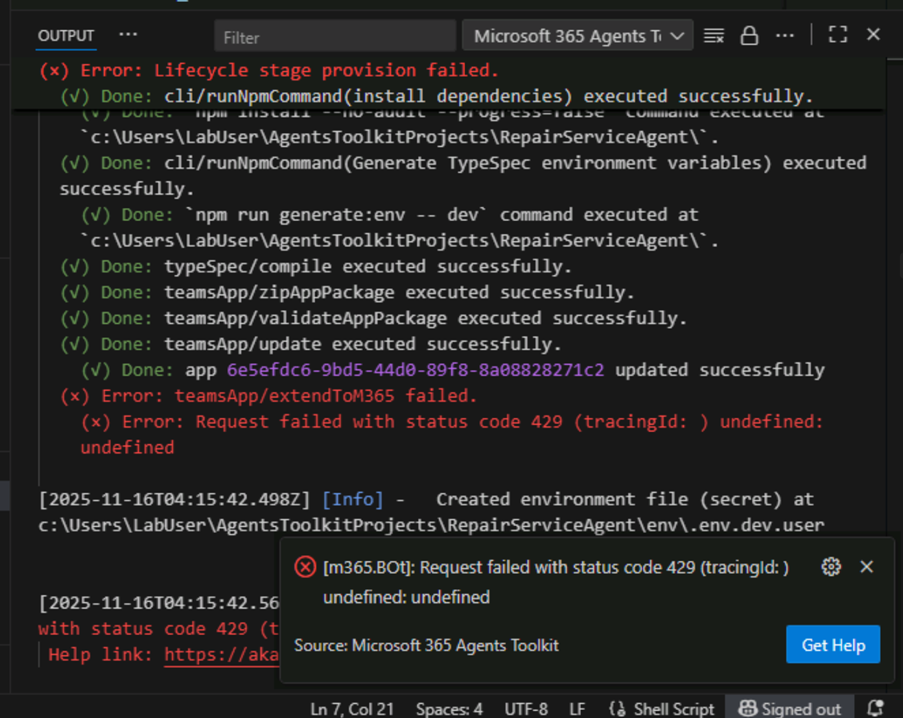

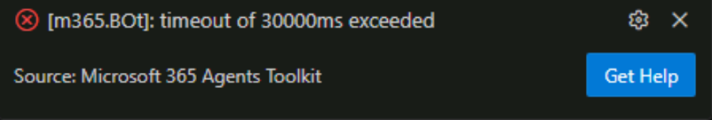

4.  Go back to the open **browser** session and do a **refresh**.

5.  In the **RepairServiceAgent**, start by using the conversation
    starter **Create repair**. Replace parts of the prompt to add a
    title, then send it to the chat to initiate the interaction. For
    example:

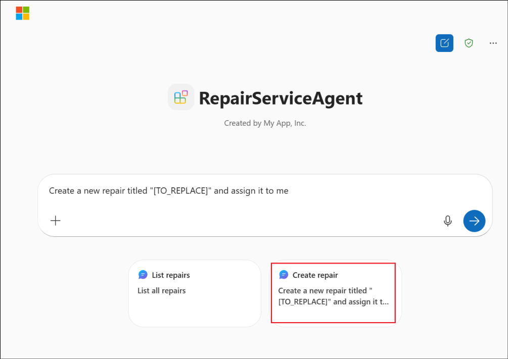

6.  Replace the **“\[TO REPLACE\]”** with +++rear camera issue+++ and
    assign it to me.

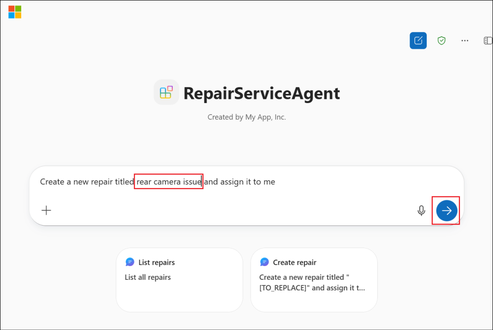

7.  The confirmation dialog if you notice has more metadata that what
    you sent, thanks to the new instructions.

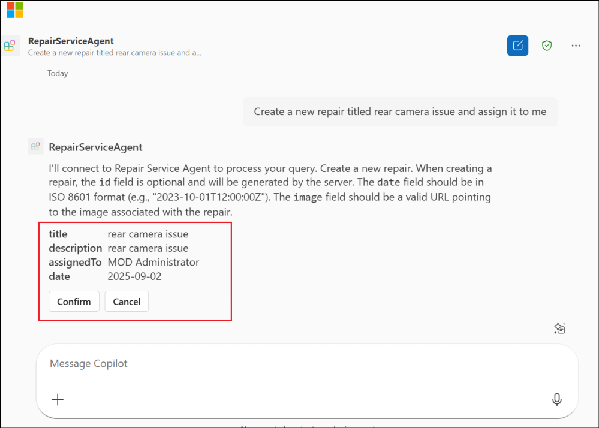

8.  Proceed to add the item by **confirming** the dialog.

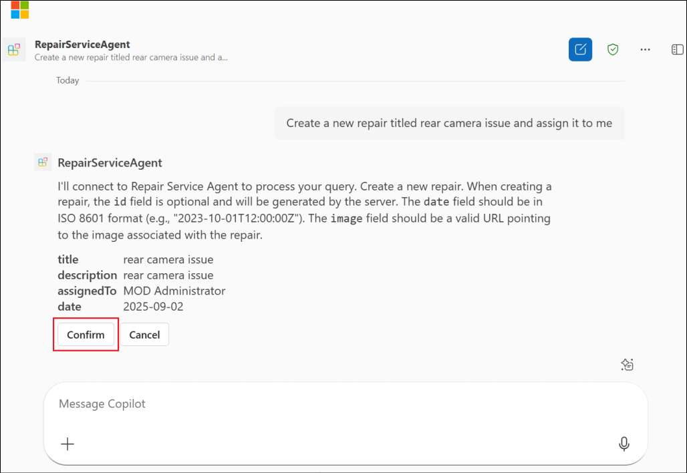

9.  The agent responds with the **created item**.

\

12. Next, you will test the new analytical capability of your agent.
    Open a new chat by selecting the **New chat** button on the top
    right corner of your agent.

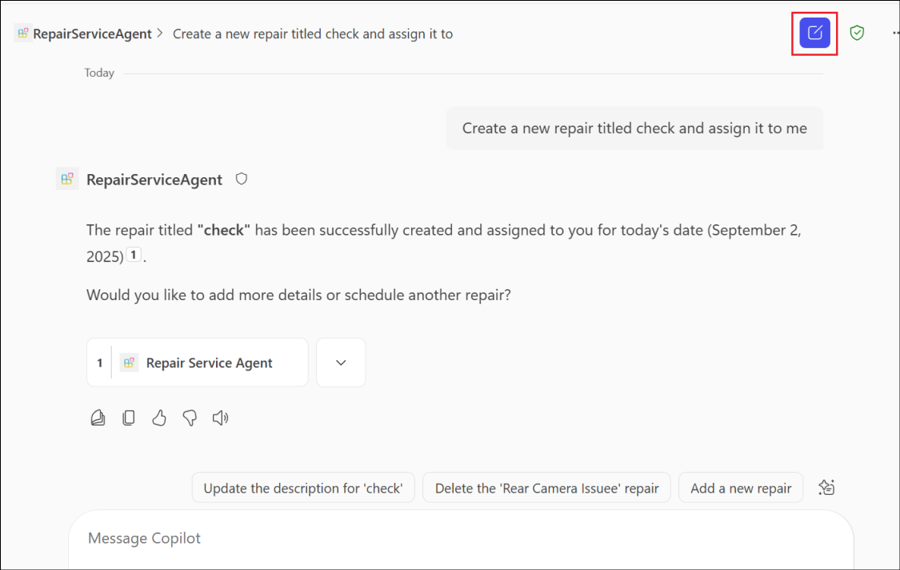

13. Next, copy the prompt below and paste it to the message box and hit
    enter to send it.

+++Classify repair items based on title into three distinct categories:
Routine Maintenance, Critical, and Low Priority. Then, generate a chart
displaying the percentage representation of each category.+++

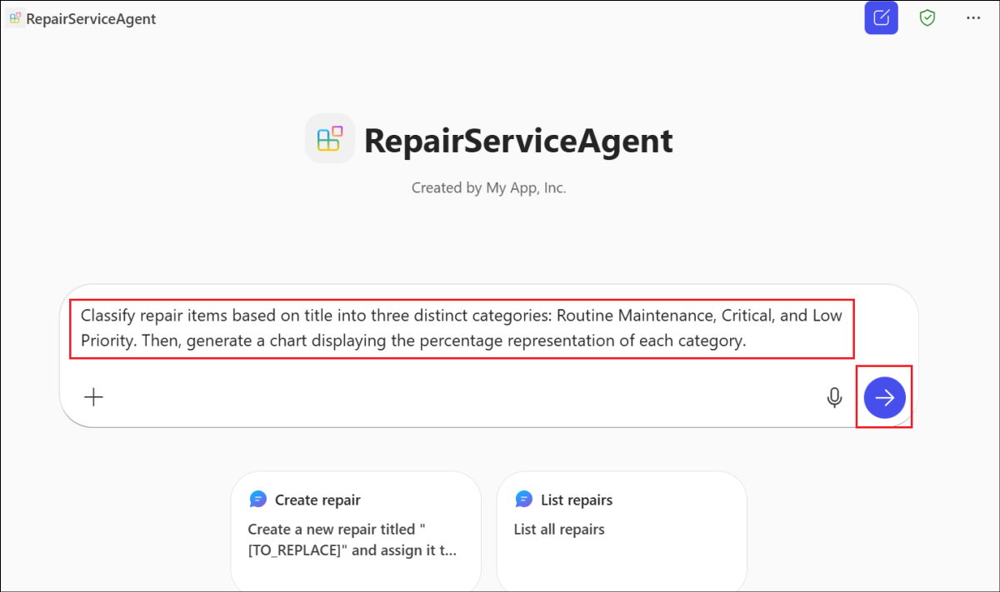

14. You should get some response similar to below screen. It may vary
    sometimes.

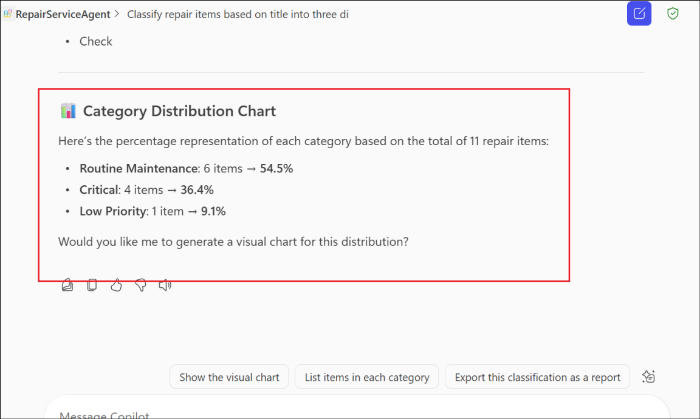

15. Open the link
    +++[https://dev.teams.microsoft.com+++](https://dev.teams.microsoft.com+++/).

16. Select **Apps** from the left pane.

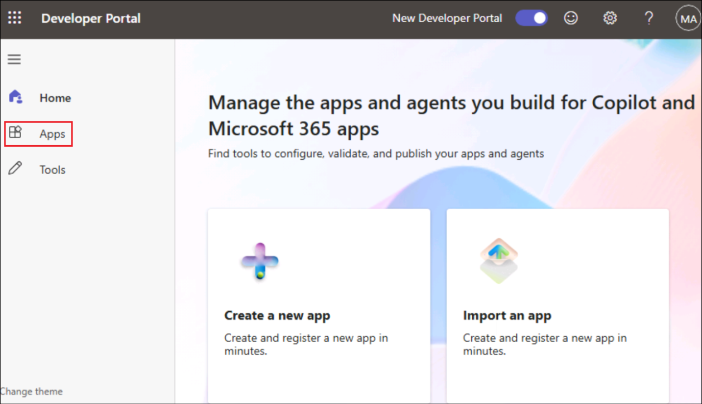

17. You will find the **RepairServiceAgent** under Apps.

18. Scroll to the right, click on the **3 dots** and select **Delete**.
    This needs to be done in order to provision another agent. Since you
    will be creating another agent in the next lab, this step needs to
    be done.

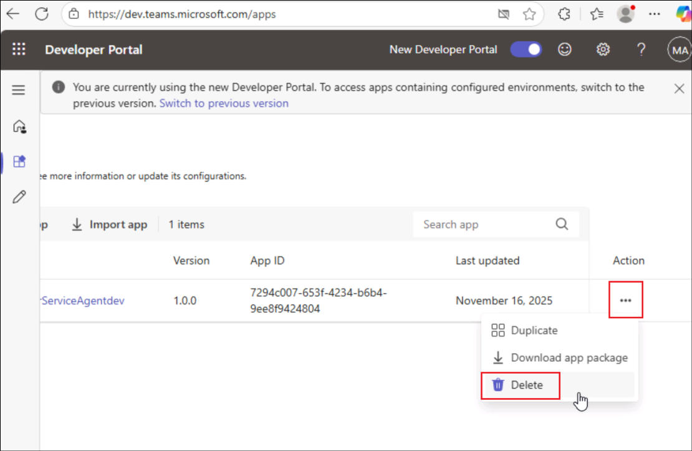

**Summary:**

In this lab, you have:

- Used **TypeSpec** to describe APIs and bind them to Copilot actions.

- Configure **Adaptive Cards** to display repair records in a rich
  visual layout.

- Build a complete scenario where users can interact naturally with
  Copilot to manage repair data.

This lab demonstrated how Declarative Agents leverage the **Copilot
platform’s orchestration, foundation models, and security controls** to
deliver a familiar and consistent user experience while integrating with
custom business data and workflows.
